SpectroNaut_analysis
================
peyman
2026-06-01

# Packages

``` r
library(knitr)
library(data.table)
library(tidyverse)

library(ggplot2)
library(ggrepel)
library(grid)
library(ggraph)
library(tidygraph)
library(gridExtra)
library(pheatmap)

library(QFeatures)
library(SummarizedExperiment)
library(limma)
library(UpSetR)


library(ReactomePA)
library(org.Hs.eg.db)
library(clusterProfiler)
library(stringr)
library(scales)

library(VennDiagram)
```

# Load Contaminants

Imports a FASTA database of known background contaminants. We extract
these accession numbers to actively flag and filter them out of our
downstream biological dataset.

``` r
# A custom function to read FASTA files without stripping headers
# ---------------------------------------------------------------
#   read_fasta_full <- function(file_path) {
#     lines <- readLines(file_path)
#     is_header <- grepl("^>", lines)
#     
#     headers <- lines[is_header]
#     
#     # Find start and end indices for each sequence block
#     starts <- which(is_header) + 1
#     ends <- c(which(is_header)[-1] - 1, length(lines))
#     
#     # Collapse multi-line sequences into a single string per header
#     seqs <- mapply(function(s, e) paste(lines[s:e], collapse=""), starts, ends)
#     names(seqs) <- headers
#     return(seqs)
#   }
#   
#   # ---------------------------------------------------------------------
#   
#   setwd('~/Desktop/proj/MsProteomics/')
#   
#   refastA <- read_fasta_full("./Comb_uniprotkb_2026_05_18_Contaminants.fasta")
#   accs <- strsplit(names(refastA), split = '\\|')
#   accs <- data.frame(do.call(rbind, lapply(accs, function(x) x[2:3])))
#   accsContam <- accs$X1[grep('CON_', accs$X2)]
#   rm(refastA, accs, read_fasta_full)
#   gc()
```

# Load Spectronaut file

Imports the raw, filtered precursor report generated by Spectronaut.
This step cleans up numeric formatting, flags target/decoy sequences,
identifies potential contaminants, and dynamically extracts experimental
group and replicate metadata directly from the file names.

``` r
#   df.main <- fread("./20260524/Filtered_Spectronaut_Report.v2.tsv")
#   
#   df.main <- df.main %>%
#     filter(!R.FileName%in%c("R.FileName", "Centroid"))%>%
#     mutate(SampleID = str_remove(R.FileName, "_[^_]*$"),
#            
#            EG.IsDecoy = as.logical(toupper(EG.IsDecoy)),
#            FG.Quantity = as.numeric(gsub(",", ".", FG.Quantity)),
#            EG.PEP = as.numeric(gsub(",", ".", EG.PEP)),
#            EG.Cscore = as.numeric(gsub(",", ".", EG.Cscore)),
#            
#            type = ifelse(EG.IsDecoy, "Decoy", "Target"),
#            Potential.contaminant = ifelse(PG.ProteinGroups%in%accsContam, "+", "-"),
#            )%>%
#     as.data.frame()
#   
#   
#   
#   filenames <- strsplit(df.main$R.FileName, split = '_')
#   df.main$group <- unlist(lapply(X = filenames,
#                                  FUN = function(x){return(x[1])}))
#   
#   
#   table(df.main$group)
#   rabahIdx <- which(df.main$group=='20260331')
#   df.main$group[rabahIdx] <- paste0('Rabah_', df.main$group[rabahIdx])
#   df.main$group <- as.factor(df.main$group)
#   table(df.main$group)
#   
#   
#   df.main$Rep <- unlist(lapply(X = filenames,
#                                  FUN = function(x){return(x[length(x)])}))
#   
#   
#   saveRDS(df.main, './FilteredCleaned_Spectronaut_Report.RDS')
#   
#   rm(accsContam, filenames, rabahIdx)
#   gc()
# --------------------------------------
# ***************************************************
# ************************
df.main <- readRDS('./FilteredCleaned_Spectronaut_Report.RDS');gc()
```

    ##             used   (Mb) gc trigger   (Mb)  max used   (Mb)
    ## Ncells   9554555  510.3   17606272  940.3  10495231  560.6
    ## Vcells 287139799 2190.8  377356767 2879.1 287158884 2190.9

``` r
colnames(df.main)
```

    ##  [1] "EG.PrecursorId"        "R.FileName"            "R.Condition"          
    ##  [4] "R.Replicate"           "FG.Quantity"           "PEP.StrippedSequence" 
    ##  [7] "PG.ProteinGroups"      "EG.PEP"                "EG.Cscore"            
    ## [10] "EG.IsDecoy"            "EG.IsImputed"          "SampleID"             
    ## [13] "type"                  "Potential.contaminant" "group"                
    ## [16] "Rep"

``` r
# ************************
# ***************************************************
```

# Create Metadata

Condenses the massive precursor dataframe into a clean, distinct
metadata table.

``` r
metaData <- df.main %>%
  select(R.FileName, SampleID, R.Condition, group, Rep) %>%
  group_by(R.FileName, Rep)%>%
  mutate(NrPEP = as.factor(n()))%>%
  distinct()%>%
  as.data.frame()

#   write.csv(metaData, 'metaData.csv', row.names=FALSE)
# metaData <- read.csv('metaData.csv')
```

# Number of peptides

Generates a heatmap visualization to rapidly assess the raw count of
quantified peptides across all replicates.

``` r
# metaData <- read.csv('metaData.csv')

p <- ggplot(metaData, aes(y = Rep, x = SampleID, fill = NrPEP)) +
  geom_tile(color = "white", linewidth = 1) +
  facet_wrap(~ group, scales = "free_x", ncol = 5) +
  scale_fill_manual(values = c("201311" = "skyblue",  
                               "402622" = "#FFB74D",  
                               "410269" = "#E53935")) + 
  theme_bw() +
  theme(
    strip.text = element_text(size = 12, face = "bold"),
    panel.grid = element_blank(),
    axis.text.x = element_text(angle = 35, vjust = 1, hjust = 1, colour = 'black'),
    axis.text.y = element_text(colour = 'black'),
    axis.title = element_text(face = 'bold', size = 13),
    legend.title = element_text(face = 'bold', size = 13, colour = 'black'),
    legend.text = element_text(size = 10, colour = 'black'),
    title = element_text(face = 'bold', size = 10, colour = 'black')
  ) +
  labs(
    title = "Quantified Peptide/Precursor Counts",
    subtitle = "Colors indicate distinct peptide totals for individual replicates across conditions",
    y = "Replicate",
    x = "Sample",
    fill = "NrPEP"
  )

p
```

<!-- -->

# Decoy ~ Target

Evaluates the statistical confidence of our peptide identifications. By
calculating the percentage of “Decoy” (fake, reversed sequence) hits and
plotting their score distribution against actual “Target” sequences, we
validate our False Discovery Rate (FDR).

``` r
table(df.main$EG.IsDecoy)
```

    ## 
    ##    FALSE     TRUE 
    ## 16307729  1616597

``` r
tab <- df.main %>%
  filter(n() >= 2) %>% # just to make sure
  group_by(R.FileName) %>%
  summarise(
    Nr_Decoy = sum(EG.IsDecoy),
    Total_Precursor = n(),
    Percent_Decoy = round(100 * mean(EG.IsDecoy), 2)
  )

kable(tab)
```

| R.FileName                         | Nr_Decoy | Total_Precursor | Percent_Decoy |
|:-----------------------------------|---------:|----------------:|--------------:|
| 20260331_CTRL1_1                   |    18156 |          201311 |          9.02 |
| 20260331_CTRL1_2                   |    18156 |          201311 |          9.02 |
| 20260331_CTRL1_3                   |    18156 |          201311 |          9.02 |
| 20260331_CTRL2_1                   |    18156 |          201311 |          9.02 |
| 20260331_CTRL2_2                   |    18156 |          201311 |          9.02 |
| 20260331_CTRL2_3                   |    18156 |          201311 |          9.02 |
| 20260331_CTRL_JNK-IN-8_cDDP_24h1_1 |    18156 |          201311 |          9.02 |
| 20260331_CTRL_JNK-IN-8_cDDP_24h1_2 |    18156 |          201311 |          9.02 |
| 20260331_CTRL_JNK-IN-8_cDDP_24h1_3 |    18156 |          201311 |          9.02 |
| 20260331_CTRL_cDDP_24h1_1          |    18156 |          201311 |          9.02 |
| 20260331_CTRL_cDDP_24h1_2          |    18156 |          201311 |          9.02 |
| 20260331_CTRL_cDDP_24h1_3          |    18156 |          201311 |          9.02 |
| 20260331_c-jun_KO1_1               |    18156 |          201311 |          9.02 |
| 20260331_c-jun_KO1_2               |    18156 |          201311 |          9.02 |
| 20260331_c-jun_KO1_3               |    18156 |          201311 |          9.02 |
| 20260331_c-jun_KO2_1               |    18156 |          201311 |          9.02 |
| 20260331_c-jun_KO2_2               |    18156 |          201311 |          9.02 |
| 20260331_c-jun_KO2_3               |    18156 |          201311 |          9.02 |
| 20260331_c-jun_KO_cDDP_24h1_1      |    37025 |          410269 |          9.02 |
| 20260331_c-jun_KO_cDDP_24h1_2      |    36312 |          402622 |          9.02 |
| 20260331_c-jun_KO_cDDP_24h1_3      |    36312 |          402622 |          9.02 |
| 20260331_c-jun_KO_cDDP_24h2_1      |    36312 |          402622 |          9.02 |
| 20260331_c-jun_KO_cDDP_24h2_2      |    36312 |          402622 |          9.02 |
| 20260331_c-jun_KO_cDDP_24h2_3      |    18156 |          201311 |          9.02 |
| Group1_CTRL_1                      |    18156 |          201311 |          9.02 |
| Group1_CTRL_2                      |    18156 |          201311 |          9.02 |
| Group1_CTRL_3                      |    18156 |          201311 |          9.02 |
| Group1_CTRL_JNK-IN-8_cDDP_24h_1    |    18156 |          201311 |          9.02 |
| Group1_CTRL_JNK-IN-8_cDDP_24h_2    |    18156 |          201311 |          9.02 |
| Group1_CTRL_JNK-IN-8_cDDP_24h_3    |    18156 |          201311 |          9.02 |
| Group1_CTRL_cDDP_24h_1             |    18156 |          201311 |          9.02 |
| Group1_CTRL_cDDP_24h_2             |    18156 |          201311 |          9.02 |
| Group1_CTRL_cDDP_24h_3             |    18156 |          201311 |          9.02 |
| Group1_c-jun_KO_1                  |    18156 |          201311 |          9.02 |
| Group1_c-jun_KO_2                  |    18156 |          201311 |          9.02 |
| Group1_c-jun_KO_3                  |    18156 |          201311 |          9.02 |
| Group1_c-jun_KO_cDDP_24h_1         |    18156 |          201311 |          9.02 |
| Group1_c-jun_KO_cDDP_24h_2         |    18156 |          201311 |          9.02 |
| Group1_c-jun_KO_cDDP_24h_3         |    18156 |          201311 |          9.02 |
| Group2_CTRL_1                      |    18156 |          201311 |          9.02 |
| Group2_CTRL_2                      |    18156 |          201311 |          9.02 |
| Group2_CTRL_3                      |    18156 |          201311 |          9.02 |
| Group2_CTRL_JNK-IN-8_cDDP_24h_1    |    18156 |          201311 |          9.02 |
| Group2_CTRL_JNK-IN-8_cDDP_24h_2    |    18156 |          201311 |          9.02 |
| Group2_CTRL_JNK-IN-8_cDDP_24h_3    |    18156 |          201311 |          9.02 |
| Group2_CTRL_cDDP_24h_1             |    18156 |          201311 |          9.02 |
| Group2_CTRL_cDDP_24h_2             |    18156 |          201311 |          9.02 |
| Group2_CTRL_cDDP_24h_3             |    18156 |          201311 |          9.02 |
| Group2_c-jun_KO_1                  |    18156 |          201311 |          9.02 |
| Group2_c-jun_KO_2                  |    18156 |          201311 |          9.02 |
| Group2_c-jun_KO_3                  |    18156 |          201311 |          9.02 |
| Group2_c-jun_KO_cDDP_24h_1         |    18156 |          201311 |          9.02 |
| Group2_c-jun_KO_cDDP_24h_2         |    18156 |          201311 |          9.02 |
| Group2_c-jun_KO_cDDP_24h_3         |    18156 |          201311 |          9.02 |
| Group3_CTRL_1                      |    18156 |          201311 |          9.02 |
| Group3_CTRL_2                      |    18156 |          201311 |          9.02 |
| Group3_CTRL_3                      |    18156 |          201311 |          9.02 |
| Group3_CTRL_JNK-IN-8_cDDP_06h_1    |    18156 |          201311 |          9.02 |
| Group3_CTRL_JNK-IN-8_cDDP_06h_2    |    18156 |          201311 |          9.02 |
| Group3_CTRL_JNK-IN-8_cDDP_06h_3    |    18156 |          201311 |          9.02 |
| Group3_CTRL_cDDP_06h_1             |    18156 |          201311 |          9.02 |
| Group3_CTRL_cDDP_06h_2             |    18156 |          201311 |          9.02 |
| Group3_CTRL_cDDP_06h_3             |    18156 |          201311 |          9.02 |
| Group3_c-jun_KO_1                  |    18156 |          201311 |          9.02 |
| Group3_c-jun_KO_2                  |    18156 |          201311 |          9.02 |
| Group3_c-jun_KO_3                  |    18156 |          201311 |          9.02 |
| Group3_c-jun_KO_cDDP_06h_1         |    18156 |          201311 |          9.02 |
| Group3_c-jun_KO_cDDP_06h_2         |    18156 |          201311 |          9.02 |
| Group3_c-jun_KO_cDDP_06h_3         |    18156 |          201311 |          9.02 |
| Group4_CTRL_1                      |    18156 |          201311 |          9.02 |
| Group4_CTRL_2                      |    18156 |          201311 |          9.02 |
| Group4_CTRL_3                      |    18156 |          201311 |          9.02 |
| Group4_CTRL_JNK-IN-8_cDDP_06h_1    |    18156 |          201311 |          9.02 |
| Group4_CTRL_JNK-IN-8_cDDP_06h_2    |    18156 |          201311 |          9.02 |
| Group4_CTRL_JNK-IN-8_cDDP_06h_3    |    18156 |          201311 |          9.02 |
| Group4_CTRL_cDDP_06h_1             |    18156 |          201311 |          9.02 |
| Group4_CTRL_cDDP_06h_2             |    18156 |          201311 |          9.02 |
| Group4_CTRL_cDDP_06h_3             |    18156 |          201311 |          9.02 |
| Group4_c-jun_KO_1                  |    18156 |          201311 |          9.02 |
| Group4_c-jun_KO_2                  |    18156 |          201311 |          9.02 |
| Group4_c-jun_KO_3                  |    18156 |          201311 |          9.02 |
| Group4_c-jun_KO_cDDP_06h_1         |    18156 |          201311 |          9.02 |
| Group4_c-jun_KO_cDDP_06h_2         |    18156 |          201311 |          9.02 |
| Group4_c-jun_KO_cDDP_06h_3         |    18156 |          201311 |          9.02 |

``` r
message("The average number of Decoys in all samples is:  ", mean(tab$Percent_Decoy), '%')
```

    ## The average number of Decoys in all samples is:  9.02%

``` r
density_data <- df.main %>%
  group_by(R.FileName, type) %>%
  reframe(
    Score = density(EG.Cscore, na.rm = TRUE)$x,
    Density = density(EG.Cscore, na.rm = TRUE)$y
  )%>%
  as.data.frame()%>%
  left_join(metaData, by = "R.FileName")
  


p <- ggplot(density_data, aes(
  x = Score, 
  y = Density, 
  color = type, 
  group = interaction(R.FileName, type) 
)) +
  geom_line(aes(linetype = as.character(Rep)), linewidth = 0.7, alpha = 0.8) +
  facet_grid(group ~ R.Condition) +
  scale_color_manual(values = c(Decoy = "red", Target = "blue")) +
  labs(
    title = "C Score Density by Replicate",
    x = "C Score", 
    y = "Density",
    linetype = "Replicate" 
  ) +
  theme_bw() 


p
```

<!-- -->

``` r
rm(tab, density_data)
gc()
```

    ##             used   (Mb) gc trigger   (Mb)  max used   (Mb)
    ## Ncells   9854801  526.4   17606272  940.3  17606272  940.3
    ## Vcells 288875138 2204.0  669727674 5109.7 669703205 5109.5

# SE object

Pivots the raw data into a matrix and constructs a formal
SummarizedExperiment object, linking the quantification data perfectly
to the row (peptide) and column (sample) metadata. Crucially, this step
mathematically sanitizes the data by replacing the artificial software
imputation values (1.01) with true R NAs to prevent statistical
artifacts.

``` r
quant_wide <- df.main %>%
  select(EG.PrecursorId, R.FileName, FG.Quantity) %>%
  pivot_wider(
    names_from = R.FileName,
    values_from = FG.Quantity,
    values_fn = max # Resolves any rare duplicate precursor entries in a single run
  ) %>%
  as.data.frame()

rownames(quant_wide) <- quant_wide$EG.PrecursorId
quant_matrix <- as.matrix(quant_wide[, -1]) 


col_data <- df.main %>%
  select(R.FileName, SampleID, R.Condition, Rep, group) %>%
  distinct() %>%
  as.data.frame()

rownames(col_data) <- col_data$R.FileName

quant_matrix <- quant_matrix[, rownames(col_data)] # *** important ***


row_data <- df.main %>%
  select(
    EG.PrecursorId,
    Sequence = PEP.StrippedSequence,
    Proteins = PG.ProteinGroups,
    PEP = EG.PEP,
    Score = EG.Cscore,
    Potential.contaminant,
    IsDecoy = EG.IsDecoy
  ) %>%
  group_by(EG.PrecursorId) %>%
  dplyr::slice(1) %>% # Take the metadata from the first appearance of the precursor
  ungroup() %>%
  as.data.frame()


rownames(row_data) <- row_data$EG.PrecursorId

# CRITICAL: Ensure the rows of the metadata match the rows of the matrix exactly
row_data <- row_data[rownames(quant_matrix), ] # *** important ***


spectronaut_se <- SummarizedExperiment(
  assays = list(intensity = quant_matrix),
  colData = DataFrame(col_data),
  rowData = DataFrame(row_data)
)

# head(assay(spectronaut_se))
assay(spectronaut_se)[1:5, sample(1:84, 5)]
```

    ##                          20260331_CTRL_JNK-IN-8_cDDP_24h1_2
    ## _DGSASEVPSELSERPK_.3                             1935.79443
    ## _DGSASEVPSELSERPK_.2                                1.00000
    ## _NEFTAWYR_.2                                      237.23714
    ## _GFYVETVVTYKEDFVPNTEK_.3                           43.35216
    ## _MQLVQESEEK_.2                                     17.05524
    ##                          Group3_CTRL_cDDP_06h_1 Group3_CTRL_cDDP_06h_3
    ## _DGSASEVPSELSERPK_.3                 2104.87061              2265.4404
    ## _DGSASEVPSELSERPK_.2                  197.49237                65.7289
    ## _NEFTAWYR_.2                          402.66885               654.7580
    ## _GFYVETVVTYKEDFVPNTEK_.3               34.21013                61.1679
    ## _MQLVQESEEK_.2                        456.47644               263.0441
    ##                          Group2_CTRL_JNK-IN-8_cDDP_24h_2 20260331_CTRL1_3
    ## _DGSASEVPSELSERPK_.3                          2175.17188        2055.5173
    ## _DGSASEVPSELSERPK_.2                            46.81419           1.0000
    ## _NEFTAWYR_.2                                  1480.07361         710.5341
    ## _GFYVETVVTYKEDFVPNTEK_.3                        20.57343           1.0000
    ## _MQLVQESEEK_.2                                 538.96735         539.2099

``` r
anyNA(assay(spectronaut_se))
```

    ## [1] TRUE

``` r
message("NAs before fix (constant replacment): ", sum(is.na(assay(spectronaut_se))))
```

    ## NAs before fix (constant replacment): 49

``` r
assay(spectronaut_se)[assay(spectronaut_se) <= 1.01] <- NA
message("NAs after fix (constant replacment): ", sum(is.na(assay(spectronaut_se))))
```

    ## NAs after fix (constant replacment): 1107737

``` r
#   saveRDS(spectronaut_se, './spectronaut_se.RDS')

rm(df.main, quant_wide, row_data, col_data, quant_matrix)
gc()
```

    ##            used  (Mb) gc trigger   (Mb)  max used   (Mb)
    ## Ncells  9814144 524.2   64566222 3448.3  80707777 4310.3
    ## Vcells 38078589 290.6  535782140 4087.7 669703205 5109.5

# Missing Values

Visualizes the burden of missing data across the entire experiment. This
bar plot allows us to spot if any specific sample or biological group
suffered massive signal dropouts due to technical issues.

``` r
na_df <- data.frame(
  Sample = colnames(spectronaut_se), 
  Missing_Count = nNA(spectronaut_se)$nNAcols$nNA
  )%>%
  left_join(as.data.frame(colData(spectronaut_se)), by = c('Sample'='R.FileName'))

na_df$Sample <- factor(na_df$Sample, levels = na_df$Sample)

na_df%>%
  group_by(group)%>%
  summarise(sum(Missing_Count))
```

    ## # A tibble: 5 × 2
    ##   group          `sum(Missing_Count)`
    ##   <fct>                         <int>
    ## 1 Group1                       127540
    ## 2 Group2                       154100
    ## 3 Group3                       184133
    ## 4 Group4                       188701
    ## 5 Rabah_20260331               453263

``` r
p <- ggplot(na_df, aes(x = SampleID, y = Missing_Count)) +
  geom_bar(stat = "identity", fill = "steelblue", alpha = 0.8, width = .5) +
  facet_grid(Rep~group, scales='free_x')+
  labs(
    title = "Missing Values per Sample",
    x = "Sample",
    y = "Count of NAs"
  ) +
  theme_bw() +
  theme(
    axis.text.x = element_text(angle = 45, hjust = 1, size = 10),
    plot.title = element_text(face = "bold")
  )


p
```

<!-- -->

``` r
rm(na_df)
gc()
```

    ##            used  (Mb) gc trigger   (Mb)  max used   (Mb)
    ## Ncells  9877698 527.6   51652978 2758.6  80707777 4310.3
    ## Vcells 37548922 286.5  428625712 3270.2 669703205 5109.5

# QF object

Upgrades our data to a QFeatures structure for advanced proteomics
processing. We perform rigorous quality filtering here: dropping
peptides missing in \>70% of samples, removing decoys/contaminants,
retaining strictly high-confidence peptides (PEP \< 0.05), and finally
applying a log2 transformation to establish a normal distribution for
downstream algorithms.

``` r
#   spectronaut_se <- readRDS('./spectronaut_se.RDS')

raw_mat <- assay(spectronaut_se)
sum(is.na(raw_mat))
```

    ## [1] 1107737

``` r
sum(is.nan(raw_mat))
```

    ## [1] 49

``` r
sum(is.infinite(raw_mat))
```

    ## [1] 0

``` r
raw_mat[is.nan(raw_mat)] <- NA

assay(spectronaut_se) <- raw_mat
rm(raw_mat)


spectronaut_se_70na <- filterNA(spectronaut_se, pNA = 0.70) #  70 %

dim(spectronaut_se)
```

    ## [1] 201310     84

``` r
dim(spectronaut_se_70na)
```

    ## [1] 201025     84

``` r
# ***************************************************************
# ---------------------------------------------------------
# --------- QF object ------------------
# ---------------------------------------------------------
spectronaut_qf <- QFeatures(list(peptides_raw = spectronaut_se_70na))
colData(spectronaut_qf) <- colData(spectronaut_se)

table(rowData(spectronaut_qf[["peptides_raw"]])$IsDecoy,
      rowData(spectronaut_qf[["peptides_raw"]])$Potential.contaminant)
```

    ##        
    ##              -      +
    ##   FALSE 182439    466
    ##   TRUE   18115      5

``` r
sp_qf_filtered <- spectronaut_qf |>
  filterFeatures(~ IsDecoy == "FALSE" | IsDecoy == FALSE) |> 
  filterFeatures(~ Potential.contaminant != "+") |> 
  filterFeatures(~ PEP < 0.05)
```

    ## 'IsDecoy' found in 1 out of 1 assay(s)

    ## 'Potential.contaminant' found in 1 out of 1 assay(s)

    ## 'PEP' found in 1 out of 1 assay(s)

``` r
dim(assay(sp_qf_filtered))
```

    ## [1] 108804     84

``` r
message("Number of proteins are: \nBefore filtering: ",
        length(unique(rowData(spectronaut_qf[["peptides_raw"]])$Proteins)),
        "\nAfter filtering: ",
        length(unique(rowData(sp_qf_filtered[["peptides_raw"]])$Proteins)))
```

    ## Number of proteins are: 
    ## Before filtering: 8032
    ## After filtering: 7562

``` r
# -------------------------------------------
# ------ log scale of peptide 
# -----------------------------------------
sp_qf_filtered_log <- sp_qf_filtered |>
  
  logTransform(i = "peptides_raw",
                 name = "log_peptides") 


# saveRDS(sp_qf_filtered_log, './sp_qf_filtered_log.RDS')

rm(spectronaut_se, spectronaut_se_70na, spectronaut_qf, sp_qf_filtered)
gc()
```

    ##            used  (Mb) gc trigger   (Mb)  max used   (Mb)
    ## Ncells  9723014 519.3   41322383 2206.9  80707777 4310.3
    ## Vcells 37793043 288.4  342900570 2616.2 669703205 5109.5

# Imputation

Defines our strategy for recovering missing values using different
imputation methods for random technical dropouts (Missing At Random,
MAR) and low-abundance biological dropouts (Missing Not At Random, MNAR)
at the instrument’s limit of detection.

``` r
# sp_qf_filtered_log <- readRDS('./sp_qf_filtered_log.RDS')

# set.seed(123)
# 
# sp_qf_filtered_log <- impute(
#   sp_qf_filtered_log, 
#   i = "log_peptides", 
#   name = "impute_zero", 
#   method = "zero"
# )
# 
# sp_qf_filtered_log <- impute(
#   sp_qf_filtered_log, 
#   i = "log_peptides", 
#   name = "impute_MinDet", 
#   method = "MinDet"
# )
# 
# invisible(capture.output({
#   sp_qf_filtered_log <- impute(
#   sp_qf_filtered_log, 
#   i = "log_peptides", 
#   name = "impute_knn", 
#   method = "knn"
#   )
# }))
# 
# sp_qf_filtered_log <- impute(
#   sp_qf_filtered_log, 
#   i = "log_peptides", 
#   name = "impute_bpca", 
#   method = "bpca"
# )
# 
# 
# sp_qf_filtered_log <- impute(
#   sp_qf_filtered_log, 
#   i = "log_peptides", 
#   name = "impute_QRILC",
#   method = "QRILC"
# )
#  
#  
# raw_mat <- assay(sp_qf_filtered_log, "log_peptides")
# na_count_per_row <- rowSums(is.na(raw_mat))
# is_mar_vector <- na_count_per_row < 10
# 
# invisible(capture.output({
#   sp_qf_filtered_log <- impute(
#   sp_qf_filtered_log, 
#   i = "log_peptides", 
#   name = "impute_knn_QRILC",
#   method = "mixed",
#   randna = is_mar_vector, 
#   mar = "knn", 
#   mnar = "QRILC")
# }))
# 
# sp_qf_filtered_log <- impute(
#   sp_qf_filtered_log, 
#   i = "log_peptides", 
#   name = "impute_bpca_QRILC",
#   method = "mixed",
#   randna = is_mar_vector, 
#   mar = "bpca", 
#   mnar = "QRILC")
# 
# 


# saveRDS(sp_qf_filtered_log, './sp_qf_filtered_log_imputed.RDS')
rm(sp_qf_filtered_log)
gc()
```

    ##            used  (Mb) gc trigger   (Mb)  max used   (Mb)
    ## Ncells  9522406 508.6   33057907 1765.5  80707777 4310.3
    ## Vcells 17558565 134.0  274320456 2092.9 669703205 5109.5

# Imputation vis

Generates density plots to visually audit our imputation strategies.
This perfectly illustrates how the selected a mixed model (knn_QRILC).

``` r
sp_qf_flt_log_impt <- readRDS('./sp_qf_filtered_log_imputed.RDS')
# -------------------------------------
layout(matrix(1:12, nrow = 3, byrow = FALSE),
       heights = c(0.12, 1, 1, 1))

## ===========================
## Column 1 (Baseline)
## ===========================

par(mar = c(0,0,0,0))
plot.new()
text(0.5, 0.5, "Baseline", font = 2, cex = 2)

par(mar = c(4,4,2,1))
plot(density(na.omit(assay(sp_qf_flt_log_impt, "log_peptides"))), main = "No imputation")
plot(density(na.omit(assay(sp_qf_flt_log_impt, "impute_zero"))), main = "Constant replacment (Zero)")


## ===========================
## Column 2 (MAR)
## ===========================

par(mar = c(0,0,0,0))
plot.new()
text(0.5, 0.5, "MAR imputation", font = 2, cex = 2)

par(mar = c(4,4,2,1))
plot(density(na.omit(assay(sp_qf_flt_log_impt, "impute_knn"))), main = "KNN",ylab='')
plot(density(na.omit(assay(sp_qf_flt_log_impt, "impute_bpca"))), main = "bPCA",ylab='')

## ===========================
## Column 3 (MNAR)
## ===========================

par(mar = c(0,0,0,0))
plot.new()
text(0.5, 0.5, "MNAR imputation", font = 2, cex = 2)

par(mar = c(4,4,2,1))
plot(density(na.omit(assay(sp_qf_flt_log_impt, "impute_MinDet"))), main = "MinDet",ylab='')
plot(density(na.omit(assay(sp_qf_flt_log_impt, "impute_QRILC"))), main = "QRILC",ylab='')


## ===========================
## Column 4 (Mixed)
## ===========================

par(mar = c(0,0,0,0))
plot.new()
text(0.5, 0.5, "Hybrid imputation", font = 2, cex = 2)

par(mar = c(4,4,2,1))
plot(density(na.omit(assay(sp_qf_flt_log_impt, "impute_knn_QRILC"))), main = "KNN + QRILC",ylab='')
plot(density(na.omit(assay(sp_qf_flt_log_impt, "impute_bpca_QRILC"))), main = "bPCA + QRILC",ylab='')
```

<!-- -->

``` r
layout(1)


# **************************************************************
# ----------- Does the QRILC work in the mix model? ------------
# ********************************************************'
raw_mat <- assay(sp_qf_flt_log_impt, "peptides_raw")
imputed_mat <- assay(sp_qf_flt_log_impt, "impute_knn_QRILC")

na_count_per_row <- rowSums(is.na(raw_mat))
is_mar_vector <- na_count_per_row < 10  # TRUE = KNN, FALSE = QRILC

qrilc_rows <- !is_mar_vector 

missing_before <- sum(is.na(raw_mat[qrilc_rows, ]))
missing_after <- sum(is.na(imputed_mat[qrilc_rows, ]))

print(paste("QRILC successfully imputed", missing_before - missing_after, "values!"))
```

    ## [1] "QRILC successfully imputed 67353 values!"

``` r
rm(raw_mat, imputed_mat, na_count_per_row, is_mar_vector, qrilc_rows, missing_before, missing_after)
```

# norma peptides

Benchmarks three independent normalization strategies (Median Centering,
Quantile Normalization, and VSN) to mathematical correct for technical
variance and differing injection amounts between the individual mass
spectrometer runs.

``` r
# **********************************************************
# ---- mixed model knn_QRILC was selected ---------------
# *********************************************************

# -------------------------------------------
# ------ impute_knn_QRILC_log -> Median Center
# -----------------------------------------
sp_qf_flt_log_impt <- normalize(sp_qf_flt_log_impt,
                            i = "impute_knn_QRILC",
                            name = "MedianCenter_peptides",
                            method = "center.median") 

# -------------------------------------------
# ------ log -> Quantiles
# -----------------------------------------

sp_qf_flt_log_impt <- normalize(sp_qf_flt_log_impt,
                            i = "impute_knn_QRILC",
                            name = "Quantiles_peptides",
                            method = "quantiles") 
```

    ## Loading required namespace: preprocessCore

``` r
# -------------------------------------------
# ------ log -> VSN
# -----------------------------------------

sp_qf_flt_log_impt <- normalize(sp_qf_flt_log_impt, 
                            i = "impute_knn_QRILC",
                            name = "VSN_peptides",
                            method = "vsn") 
```

    ## Loading required namespace: vsn

``` r
# ----------------------------------------------
sp_qf_flt_log_impt_norm <- sp_qf_flt_log_impt

saveRDS(sp_qf_flt_log_impt_norm, './sp_qf_flt_log_impt_norm.RDS')
rm(sp_qf_flt_log_impt)
gc()
```

    ##             used   (Mb) gc trigger   (Mb)  max used   (Mb)
    ## Ncells   9894301  528.5   33057907 1765.5  80707777 4310.3
    ## Vcells 140160245 1069.4  295394222 2253.7 669703205 5109.5

# Comparison of norms

Plots the density distributions (total and per sample) of the normalized
datasets side-by-side.

``` r
layout(matrix(1:9, nrow = 3, byrow = FALSE),
       heights = c(0.10, 1, 1))

par(mar = c(0,0,0,0))
plot.new()
text(.5,.5,"Median Center",font=2,cex=1.8)

par(mar=c(4,4,2,1))
plot(density(na.omit(assay(sp_qf_flt_log_impt_norm[["MedianCenter_peptides"]]))), main="Overall")

plotDensities(assay(sp_qf_flt_log_impt_norm[["MedianCenter_peptides"]]), main="Per sample", legend=FALSE)

par(mar = c(0,0,0,0))
plot.new()
text(.5,.5,"Quantile Normalization",font=2,cex=1.8)

par(mar=c(4,4,2,1))
plot(density(na.omit(assay(sp_qf_flt_log_impt_norm[["Quantiles_peptides"]]))), main="Overall")

plotDensities(assay(sp_qf_flt_log_impt_norm[["Quantiles_peptides"]]), main="Per sample", legend=FALSE)


par(mar = c(0,0,0,0))
plot.new()
text(.5,.5,"VSN",font=2,cex=1.8)

par(mar=c(4,4,2,1))
plot(density(na.omit(assay(sp_qf_flt_log_impt_norm[["VSN_peptides"]]))), main="Overall")

plotDensities(assay(sp_qf_flt_log_impt_norm[["VSN_peptides"]]), main="Per sample", legend=FALSE)
```

<!-- -->

``` r
layout(1)
```

# aggregate pep to protein

The critical transition from peptide-level data to protein-level data.

``` r
# **********************************************************
# ------------- quantiles was selected ------------------
# **********************************************************
sp_qf_flt_log_impt_norm_prot <- aggregateFeatures(sp_qf_flt_log_impt_norm,
                                    i = "Quantiles_peptides",
                                    name = "Quantiles_proteins",
                                    fcol = "Proteins",
                                    fun = colMedians,
                                    na.rm = TRUE) 

rm(sp_qf_flt_log_impt_norm)
gc()
```

    ##             used   (Mb) gc trigger   (Mb)  max used   (Mb)
    ## Ncells   9915860  529.6   33057907 1765.5  80707777 4310.3
    ## Vcells 141831232 1082.1  295394222 2253.7 669703205 5109.5

# Processing_Tree

The QFeatures processing hierarchy.

``` r
plot(sp_qf_flt_log_impt_norm_prot)
```

<!-- -->

``` r
#   saveRDS(sp_qf_flt_log_impt_norm_prot, './sp_qf_flt_log_impt_norm_prot.RDS')
```

# Pep per Pro vis

Plots a histogram detailing how many unique peptides were used to
quantify each individual protein.

``` r
df <- as.data.frame(rowData(sp_qf_flt_log_impt_norm_prot[['Quantiles_proteins']]))

p <- ggplot(df, aes(x = .n)) +
    geom_histogram(fill = "#E53935", color = "black", bins = 100) +
    # Provide a manual vector of exactly where you want the numbers to appear
    scale_x_log10(breaks = c(1, 2, 3, 5, 10, 20, 50, 100, 200, 300, 400)) + 
    theme_bw() +
    labs(
        title = "Distribution of Peptides per Protein (Log Scale)",
        x = "Number of peptides [Log10 Scale]",
        y = "Protein Count"
    )


p
```

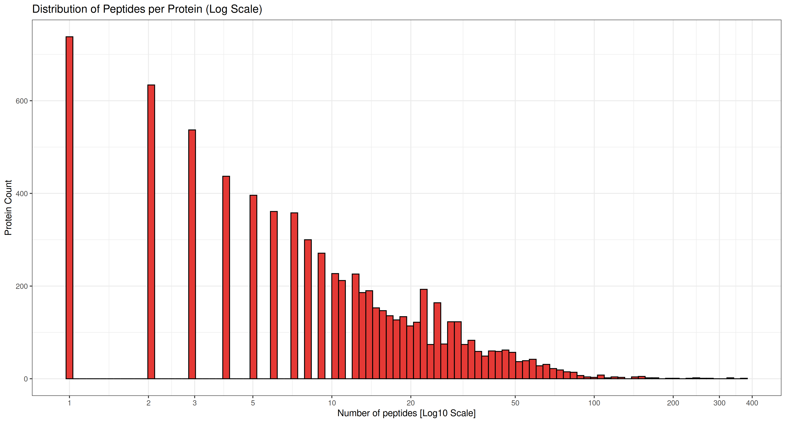<!-- -->

# Sample correlation heatmap

Calculates the Pearson correlation across all samples and plots a
clustered heatmap. This strictly tests experimental reproducibility: we
expect our biological replicates to correlate highly and cluster tightly
together before we proceed to statistical testing.

``` r
mat_cor <- assay(sp_qf_flt_log_impt_norm_prot[["Quantiles_proteins"]])
mat_cor <- mat_cor[rowSums(is.na(mat_cor)) == 0, ]

ann_col <- data.frame(
  Condition = colData(sp_qf_flt_log_impt_norm_prot)$R.Condition,
  Batch     = colData(sp_qf_flt_log_impt_norm_prot)$group,
  row.names = colnames(mat_cor)
)


pheatmap(
  cor(mat_cor, method = "pearson"),
  show_rownames = F,
  show_colnames = F,
  annotation_col = ann_col,
  annotation_row = ann_col,
  color          = colorRampPalette(c("white", "steelblue", "darkblue"))(100),
  main           = "Sample Pearson Correlation (Quantile-Normalised Proteins)",
  fontsize_row   = 7,
  fontsize_col   = 7
)
```

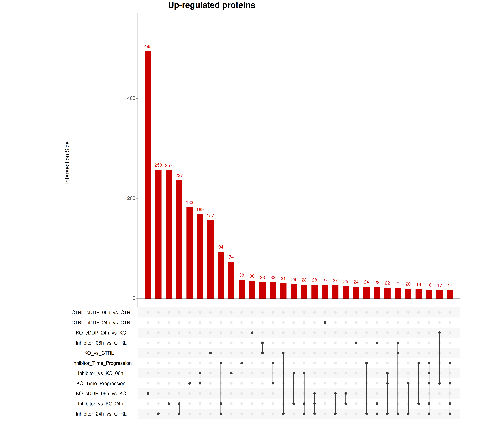<!-- -->

``` r
rm(mat_cor, ann_col)
```

# Housekeeper’s intensity

The expression profile of GAPDH (a standard housekeeping protein) across
all samples.

``` r
# plot GAPDH which is a housekeeper
df <- sp_qf_flt_log_impt_norm_prot["P04406", ,
            c("Quantiles_peptides", "Quantiles_proteins")] |>
  longFormat() |>
  as.data.frame() |>
  dplyr::filter(!is.na(value)) |>
  left_join(as.data.frame(colData(sp_qf_flt_log_impt_norm_prot)), by = c('colname'='R.FileName'))
```

    ## Warning: 'experiments' dropped; see 'drops()'

    ## harmonizing input:
    ##   removing 924 sampleMap rows not in names(experiments)

``` r
p <- ggplot(df, aes(x = colname, y = value, group = rowname, color = rowname)) +
  geom_line(linewidth = 1, show.legend = F) +
  geom_point(size = 2, show.legend = F) +
  facet_grid(assay~group, scales='free') +
  theme_bw() +
  theme(axis.text.x = element_blank()) +
  labs(
    title = "Protein Aggregation Profile (P04406: GAPDH)", 
    x = "Sample", 
    y = "Normalized Intensity"
  )


p
```

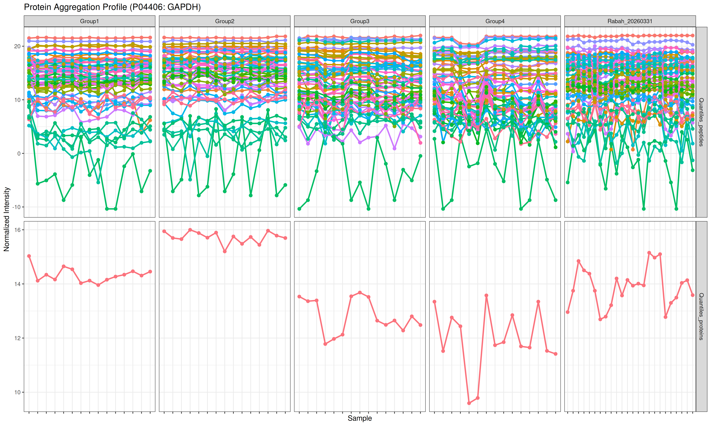<!-- -->

# c-Jun’s intensity

Tracks our primary target of interest (c-Jun) across the experiment.
This gives us an immediate, ground-level view of how the protein
responds to different treatments and timestamps before running complex,
multi-protein statistics.

``` r
df <- sp_qf_flt_log_impt_norm_prot["P05412", ,
            c("Quantiles_peptides", "Quantiles_proteins")] |>
  longFormat() |>
  as.data.frame() |>
  dplyr::filter(!is.na(value)) |>
  left_join(as.data.frame(colData(sp_qf_flt_log_impt_norm_prot)), by = c('colname'='R.FileName'))
```

    ## Warning: 'experiments' dropped; see 'drops()'

    ## harmonizing input:
    ##   removing 924 sampleMap rows not in names(experiments)

``` r
p <- ggplot(df, aes(x = colname, y = value, group = rowname, color = rowname)) +
  geom_line(linewidth = 1, show.legend = T) +
  geom_point(size = 2, show.legend = T) +
  facet_grid(assay~group, scales='free') +
  theme_bw() +
  theme(axis.text.x = element_text(angle = 45, hjust = 1, vjust = 1, size=7),
        legend.position = 'top') +
  labs(
    title = "Protein Aggregation Profile (P05412: c-Jun)", 
    x = "Sample", 
    y = "Normalized Intensity (quantile)"
  )

p
```

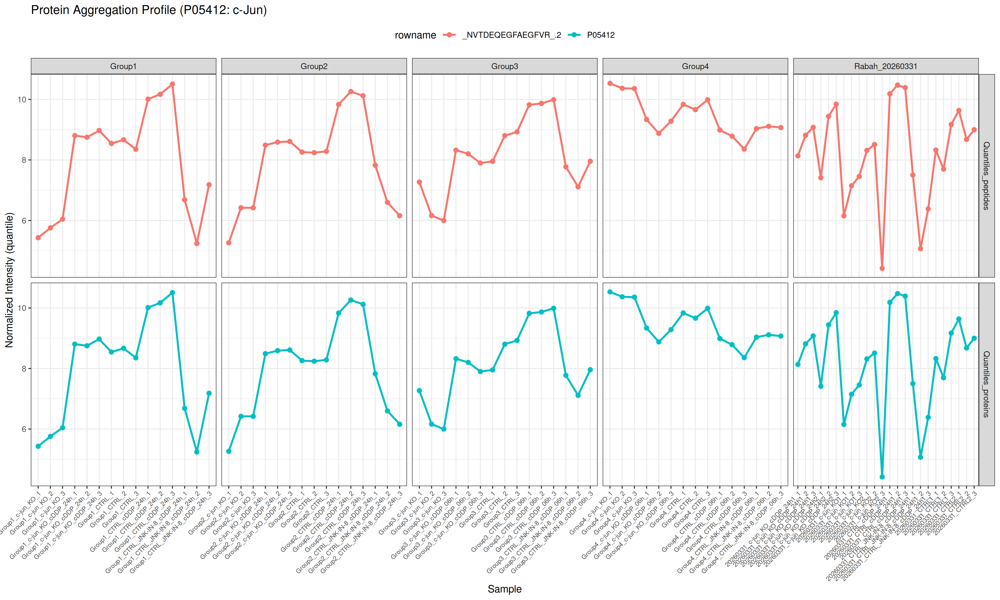<!-- -->

# c-Jun KO validation

Comparing the CRISPR c-Jun Knockout against the control condition. This
visually and statistically validates that the genetic depletion was
successful at the proteomic level.

``` r
df_cjun <- data.frame(
  colname = colnames(assay(sp_qf_flt_log_impt_norm_prot[["Quantiles_proteins"]])),
  expression = as.numeric(assay(sp_qf_flt_log_impt_norm_prot[["Quantiles_proteins"]])["P05412", ])
) |>
  left_join(
    as.data.frame(colData(sp_qf_flt_log_impt_norm_prot[["Quantiles_proteins"]])),
    by = c("colname" = "R.FileName")
  ) |>
  mutate(R.Condition = factor(R.Condition, levels = c("CTRL", "c-jun_KO")))


p <- ggplot(df_cjun |> filter(R.Condition %in% c("CTRL", "c-jun_KO")),   # ---- baseline ----
            aes(x = R.Condition, y = expression, fill = R.Condition)) +
  geom_violin(alpha = 0.3, color = NA, adjust = 0.8) + 
  geom_boxplot(outlier.shape = NA, width = 0.4, alpha = 0.7, color = "grey20") +
  geom_jitter(width = 0.15, size = 3, alpha = 0.9, stroke = 0.5, shape=21) +
  facet_wrap(~ group, ncol = 5) + 
  geom_text_repel(aes(label = SampleID), size = 3, max.overlaps = 15) +
  scale_fill_manual(values = c("c-jun_KO" = "#E57373", "CTRL" = "#4DB6AC"),
                    labels = c("c-jun_KO" = "c-Jun KO", "CTRL" = "CRISPR Control")) +
  labs(
    title = "Validation of c-Jun (P05412) Protein Depletion",
    subtitle = "Quantile-Normalized Baseline Abundance",
    x = "Genotype",
    y = "Log2 Normalized Intensity"
  ) +
  theme_bw(base_size = 12) + # Increases default font sizes globally
  theme(
    plot.title        = element_text(face = "bold", size = 14, hjust = 0.5),
    plot.subtitle     = element_text(size = 11, color = "grey40", hjust = 0.5),
    axis.title        = element_text(face = "bold"),
    axis.text         = element_blank(),
    panel.grid.minor  = element_blank(),
    panel.grid.major.x = element_blank(), 
    legend.position   = "bottom",
    legend.title = element_blank()
  )


p
```

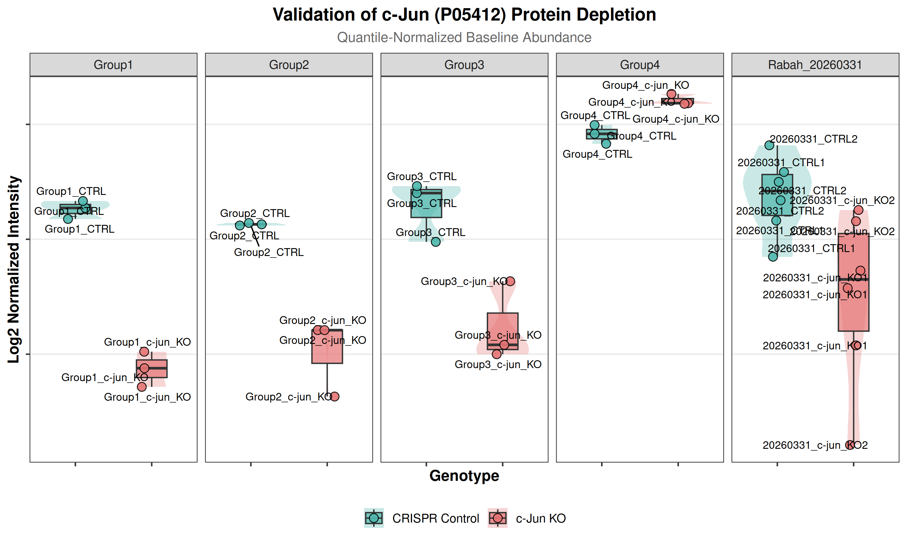<!-- -->

# PCA (before batch correction)

See if the samples naturally separate based on true biological
conditions, or if they are confounded by technical batch effects.

``` r
mat_pca <- assay(sp_qf_flt_log_impt_norm_prot[["Quantiles_proteins"]])
mat_pca <- mat_pca[rowSums(is.na(mat_pca)) == 0, ]

pca_raw     <- prcomp(t(mat_pca), scale. = TRUE)
var_exp     <- pca_raw$sdev^2 / sum(pca_raw$sdev^2) * 100
pc1_v       <- round(var_exp[1], 1)
pc2_v       <- round(var_exp[2], 1)

# Short label = SampleID_Rep (less crowded)
pca_df <- as.data.frame(pca_raw$x[, 1:4]) |>
  mutate(
    R.FileName = rownames(pca_raw$x),
    Label      = paste0(
      colData(sp_qf_flt_log_impt_norm_prot)[R.FileName, "SampleID"], "_",
      colData(sp_qf_flt_log_impt_norm_prot)[R.FileName, "Rep"]
    )
  ) |>
  left_join(as.data.frame(colData(sp_qf_flt_log_impt_norm_prot)), by = "R.FileName")

make_pca_plot <- function(df, color_var, title_suffix) {
  ggplot(df, aes(x = PC1, y = PC2, color = .data[[color_var]], label = Label)) +
    geom_point(size = 3, alpha = 0.7) +
    geom_text_repel(size = 3, show.legend = FALSE, max.overlaps = 20) +
    labs(
      title    = paste0("PCA (", title_suffix, ")"),
      subtitle = "Quantile-Normalised Protein Intensities",
      x        = paste0("PC1 (", pc1_v, "%)"),
      y        = paste0("PC2 (", pc2_v, "%)")
    ) +
    theme_bw() +
    theme(plot.title  = element_text(face = "bold", size = 14),
          axis.title  = element_text(face = "bold"))
}

make_pca_plot(pca_df, "R.Condition", "Before batch correction — coloured by Condition")
```

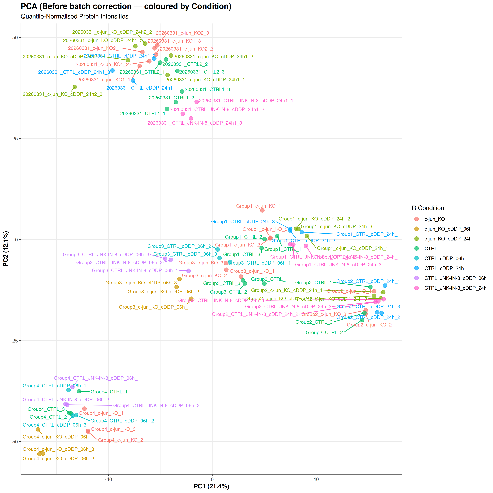<!-- -->

``` r
make_pca_plot(pca_df, "group",       "Before batch correction — coloured by Batch")
```

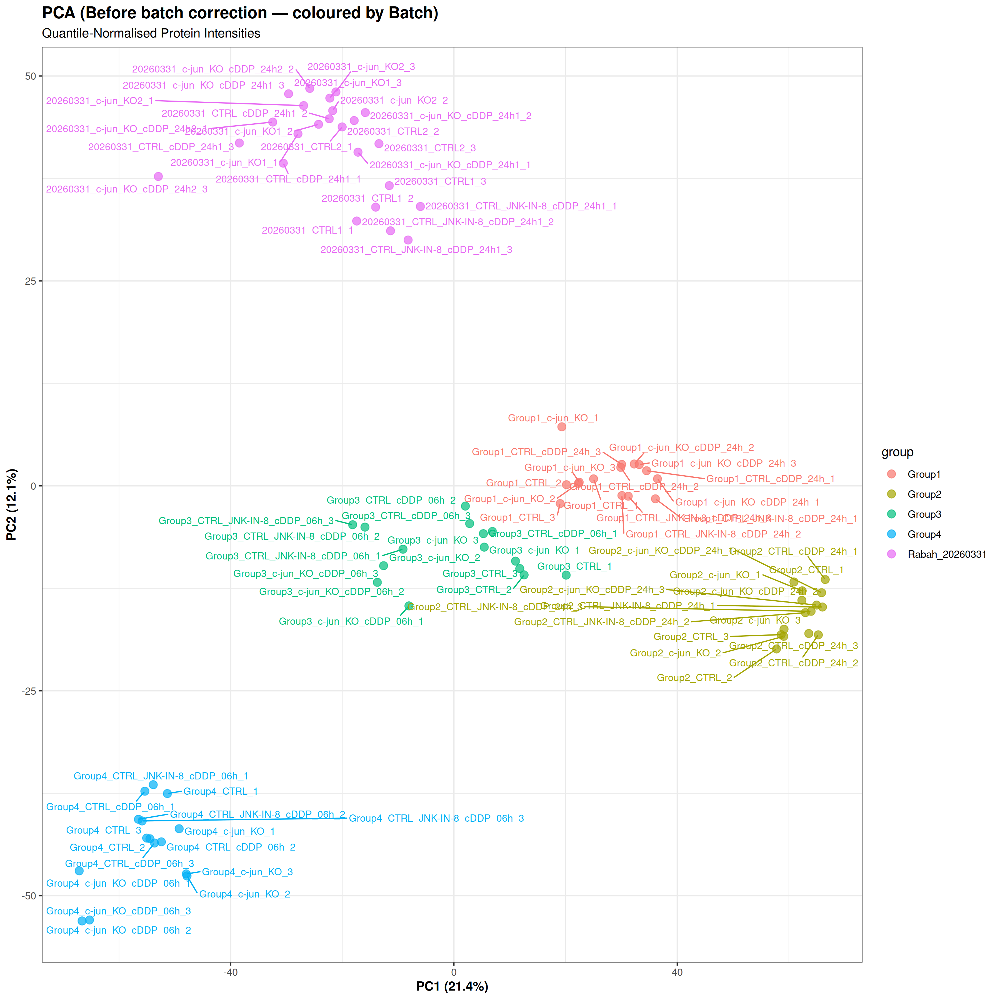<!-- -->

# PCA (after batch correction)

Deploys limma::removeBatchEffect to mathematically strip out technical
processing variations (run dates)

``` r
batch_labels  <- colData(sp_qf_flt_log_impt_norm_prot)[colnames(mat_pca), "group"]
mat_corrected <- removeBatchEffect(mat_pca, batch = batch_labels)

pca_corr  <- prcomp(t(mat_corrected), scale. = TRUE)
var_exp_c <- pca_corr$sdev^2 / sum(pca_corr$sdev^2) * 100
pc1_c     <- round(var_exp_c[1], 1)
pc2_c     <- round(var_exp_c[2], 1)

pca_df_c <- as.data.frame(pca_corr$x[, 1:4]) |>
  mutate(
    R.FileName = rownames(pca_corr$x),
    Label      = paste0(
      colData(sp_qf_flt_log_impt_norm_prot)[R.FileName, "SampleID"], "_",
      colData(sp_qf_flt_log_impt_norm_prot)[R.FileName, "Rep"]
    )
  ) |>
  left_join(as.data.frame(colData(sp_qf_flt_log_impt_norm_prot)), by = "R.FileName")

make_pca_plot_c <- function(df, color_var, title_suffix) {
  ggplot(df, aes(x = PC1, y = PC2, color = .data[[color_var]], label = Label)) +
    geom_point(size = 3, alpha = 0.7) +
    geom_text_repel(size = 3, show.legend = FALSE, max.overlaps = 20) +
    labs(
      title    = paste0("PCA (", title_suffix, ")"),
      subtitle = "Batch-Corrected Quantile-Normalised Intensities",
      x        = paste0("PC1 (", pc1_c, "%)"),
      y        = paste0("PC2 (", pc2_c, "%)")
    ) +
    theme_bw() +
    theme(plot.title  = element_text(face = "bold", size = 14),
          axis.title  = element_text(face = "bold"))
}

make_pca_plot_c(pca_df_c, "R.Condition", "After batch correction — coloured by Condition")
```

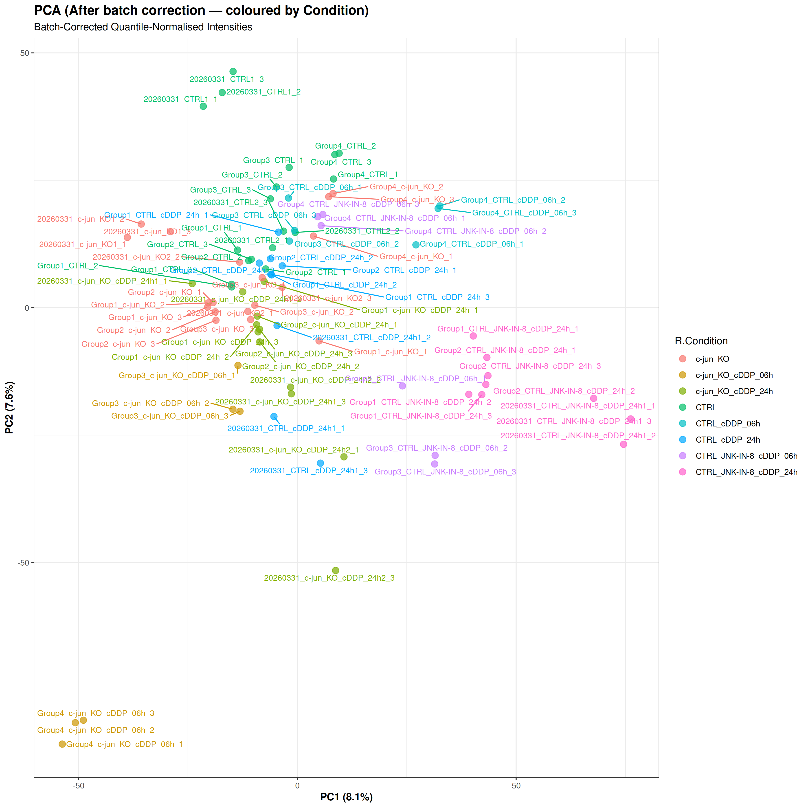<!-- -->

``` r
make_pca_plot_c(pca_df_c, "group",       "After batch correction — coloured by Batch")
```

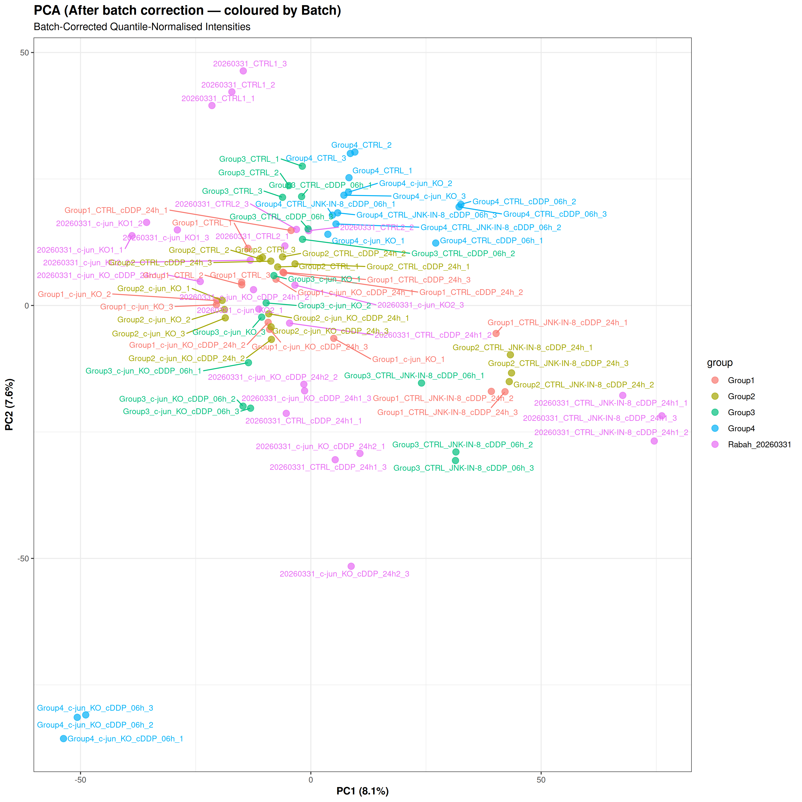<!-- -->

# PCA after remove G4

Safely excludes an anomalous outlier cluster (Group 4).

``` r
# ── Filter out Group 4 samples from the matrix ────────────────────────
# Find which column names (samples) do NOT belong to Group4
samples_to_keep <- colnames(mat_pca)[colData(sp_qf_flt_log_impt_norm_prot)[colnames(mat_pca), "group"] != "Group4"]

# Subset the matrix to drop Group 4
mat_pca_clean <- mat_pca[, samples_to_keep]


# ── Run Batch Correction on the clean subset ─────────────────────────
# Re-extract batch labels matching only our retained samples
batch_labels  <- colData(sp_qf_flt_log_impt_norm_prot)[colnames(mat_pca_clean), "group"]
mat_corrected <- removeBatchEffect(mat_pca_clean, batch = batch_labels)
```

    ## Coefficients not estimable: batch4

    ## Warning: Partial NA coefficients for 7562 probe(s)

``` r
# ── Run PCA ──────────────────────────────────────────────────────────
pca_corr  <- prcomp(t(mat_corrected), scale. = TRUE)
var_exp_c <- pca_corr$sdev^2 / sum(pca_corr$sdev^2) * 100
pc1_c     <- round(var_exp_c[1], 1)
pc2_c     <- round(var_exp_c[2], 1)

pca_df_c <- as.data.frame(pca_corr$x[, 1:4]) |>
  mutate(
    R.FileName = rownames(pca_corr$x),
    Label      = paste0(
      colData(sp_qf_flt_log_impt_norm_prot)[R.FileName, "SampleID"], "_",
      colData(sp_qf_flt_log_impt_norm_prot)[R.FileName, "Rep"]
    )
  ) |>
  left_join(as.data.frame(colData(sp_qf_flt_log_impt_norm_prot)), by = "R.FileName")


# ── Plotting Function ─────────────────────────────────────────────────
make_pca_plot <- function(df, color_var, title_suffix) {
  ggplot(df, aes(x = PC1, y = PC2, color = .data[[color_var]], label = Label)) +
    geom_point(size = 3, alpha = 0.7) +
    geom_text_repel(size = 3, show.legend = FALSE, max.overlaps = 20) +
    labs(
      title    = paste0("PCA (", title_suffix, ")"),
      subtitle = "Batch-Corrected Quantile-Normalised Intensities (Group 4 Excluded)",
      x        = paste0("PC1 (", pc1_c, "%)"),
      y        = paste0("PC2 (", pc2_c, "%)")
    ) +
    theme_bw() +
    theme(plot.title  = element_text(face = "bold", size = 14),
          axis.title  = element_text(face = "bold"))
}

# Generate the cleaner plots
make_pca_plot_c(pca_df_c, "R.Condition", "After batch correction — coloured by Condition")
```

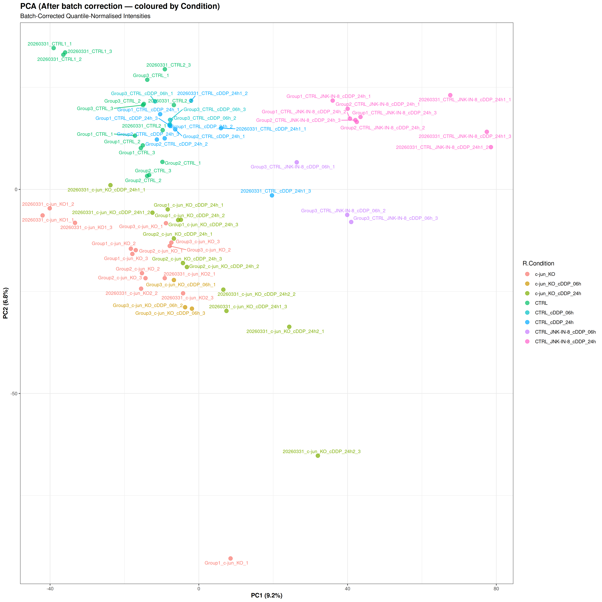<!-- -->

``` r
make_pca_plot_c(pca_df_c, "group",       "After batch correction — coloured by Batch")
```

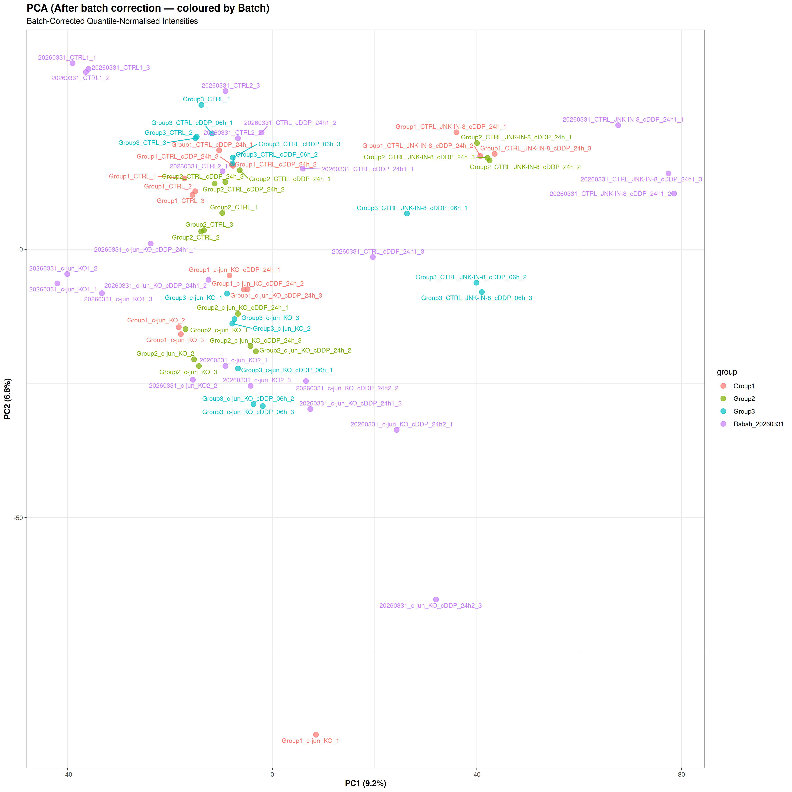<!-- -->

# Reactome Enrichment (PC1)

Extracts the specific proteins driving the highest variance in our PCA
(PC1 loadings) and runs Reactome pathway enrichment.

``` r
# ── Extract and Sort PC1 Loadings ─────────────────────────────────────
# Grab loading scores for all 7,562 proteins
pc1_loadings <- pca_corr$rotation[, "PC1"]

# Define a threshold
top_pos_proteins <- names(pc1_loadings[pc1_loadings > quantile(pc1_loadings, 0.95)])
top_neg_proteins <- names(pc1_loadings[pc1_loadings < quantile(pc1_loadings, 0.05)])

message("Proteins driving 24h late-stage drug severity (+ PC1): ", length(top_pos_proteins))
```

    ## Proteins driving 24h late-stage drug severity (+ PC1): 379

``` r
message("Proteins driving baseline / 6h early state (- PC1): ", length(top_neg_proteins))
```

    ## Proteins driving baseline / 6h early state (- PC1): 379

``` r
# ── ID Mapping Function ───────────────────────────────────────────────
run_pc1_reactome <- function(uniprot_ids, direction_title) {
  
  # Convert UniProt to Entrez IDs
  entrez_map <- bitr(uniprot_ids, 
                     fromType = "UNIPROT", 
                     toType   = "ENTREZID", 
                     OrgDb    = org.Hs.eg.db, 
                     drop     = TRUE)
  
  if(nrow(entrez_map) == 0) return(NULL)
  
  # Run Reactome Enrichment
  ego <- enrichPathway(gene          = entrez_map$ENTREZID,
                       organism      = "human",
                       pAdjustMethod = "BH",
                       pvalueCutoff  = 0.01,
                       readable      = TRUE)
  return(ego)
}

# Run enrichment for both biological directions
ego_pos_24h <- run_pc1_reactome(top_pos_proteins, "24h Drug Severity")
```

    ## 'select()' returned 1:many mapping between keys and columns

    ## Warning in bitr(uniprot_ids, fromType = "UNIPROT", toType = "ENTREZID", : 0.79%
    ## of input gene IDs are fail to map...

``` r
ego_neg_base <- run_pc1_reactome(top_neg_proteins, "Baseline and 6h Early States")
```

    ## 'select()' returned 1:many mapping between keys and columns

    ## Warning in bitr(uniprot_ids, fromType = "UNIPROT", toType = "ENTREZID", : 1.06%
    ## of input gene IDs are fail to map...

``` r
# ── Plotting Function (Ordered by Numeric Gene Ratio) ─────────────────
plot_pc1_pathways <- function(ego_obj, title_text) {
  if (!is.null(ego_obj) && nrow(ego_obj@result) > 0) {
    
    plot_data <- as.data.frame(ego_obj) |> 
      head(15) |> 
      mutate(
        # Convert character fraction string (e.g., "15/125") to real decimal number
        GeneRatio_num = sapply(GeneRatio, function(x) eval(parse(text = x))),
        # Wrap long description text dynamically to prevent cutoff margins
        Description   = stringr::str_wrap(Description, width = 45),
        # Order factors cleanly by our new numeric variable
        Description   = reorder(Description, GeneRatio_num)
      )
    
    ggplot(plot_data, aes(x = GeneRatio_num, y = Description, size = Count, color = p.adjust)) +
      geom_point(alpha = 0.85, stroke = 0.6, shape = 21, aes(fill = p.adjust)) +
      scale_x_continuous(labels = scales::label_number(accuracy = 0.001)) +
      scale_color_gradient(low = "#B71C1C", high = "#0D47A1", 
                           labels = scales::scientific_format(digits = 2)) +
      scale_fill_gradient(low = "#EF5350", high = "#42A5F5", guide = "none") +
      scale_size_continuous(range = c(4, 9)) +
      labs(
        title    = paste0("Reactome Functional Drivers: ", title_text),
        subtitle = "Proteins Selected from Extreme PC1 Loading Vectors",
        x        = "Gene Ratio (Enriched Fraction Decimal)",
        y        = NULL,
        size     = "Protein Count",
        color    = "Adjusted p-value"
      ) +
      theme_bw(base_size = 12) +
      theme(
        plot.title        = element_text(face = "bold", size = 13),
        axis.title        = element_text(face = "bold"),
        axis.text.y       = element_text(color = "black", lineheight = 0.85),
        panel.grid.minor  = element_blank(),
        legend.title      = element_text(face = "bold", size = 10)
      )
  } else {
    message("No significant pathways found for: ", title_text)
  }
}

# ── Render Plots ──────────────────────────────────────────────────────
plot_pc1_pathways(ego_pos_24h, "Positive Loadings (24h Late Cisplatin Response)")
```

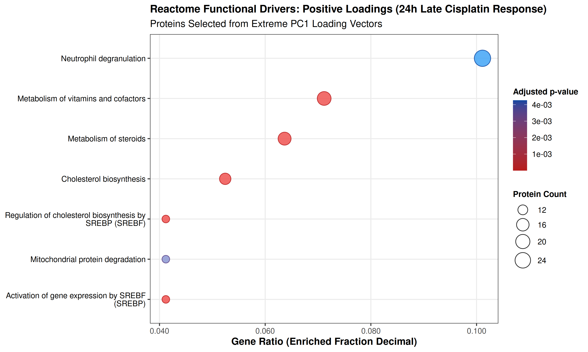<!-- -->

``` r
plot_pc1_pathways(ego_neg_base, "Negative Loadings (Baseline & 6h Kinetic State)")
```

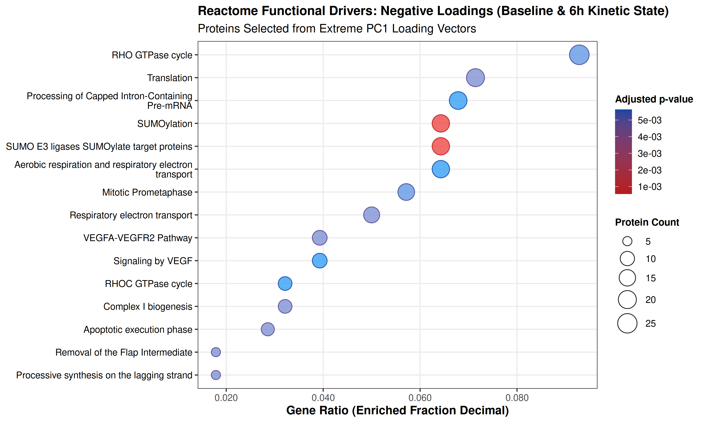<!-- -->

# DE analysis after remove G4

Identify statistically significant Differentially Expressed (DE)
proteins across multiple comparisons. The results are summarized and
visualized using an UpSet plot to capture multi-condition overlaps.

``` r
# Extract raw values
mat  <- assay(sp_qf_flt_log_impt_norm_prot[["Quantiles_proteins"]])
meta <- as.data.frame(colData(sp_qf_flt_log_impt_norm_prot))

# ── FILTER OUT GROUP 4 ANOMALY ────────────────────────────────────────────────
samples_to_keep <- rownames(meta)[meta$group != "Group4"]
meta <- meta[samples_to_keep, ]
mat  <- mat[, samples_to_keep]
# ──────────────────────────────────────────────────────────────────────────────

meta$Safe.Condition <- make.names(meta$R.Condition)

# ── Confounding audit ─────────────────────────────────────────────────────────
message("Samples per condition (Group 4 Excluded):")
```

    ## Samples per condition (Group 4 Excluded):

``` r
print(table(meta$Safe.Condition))
```

    ## 
    ##               c.jun_KO      c.jun_KO_cDDP_06h      c.jun_KO_cDDP_24h 
    ##                     15                      3                     12 
    ##                   CTRL          CTRL_cDDP_06h          CTRL_cDDP_24h 
    ##                     15                      3                      9 
    ## CTRL_JNK.IN.8_cDDP_06h CTRL_JNK.IN.8_cDDP_24h 
    ##                      3                      9

``` r
message("Conditions per batch:")
```

    ## Conditions per batch:

``` r
print(table(meta$Safe.Condition, meta$group))
```

    ##                         
    ##                          Group1 Group2 Group3 Group4 Rabah_20260331
    ##   c.jun_KO                    3      3      3      0              6
    ##   c.jun_KO_cDDP_06h           0      0      3      0              0
    ##   c.jun_KO_cDDP_24h           3      3      0      0              6
    ##   CTRL                        3      3      3      0              6
    ##   CTRL_cDDP_06h               0      0      3      0              0
    ##   CTRL_cDDP_24h               3      3      0      0              3
    ##   CTRL_JNK.IN.8_cDDP_06h      0      0      3      0              0
    ##   CTRL_JNK.IN.8_cDDP_24h      3      3      0      0              3

``` r
design <- model.matrix(~ 0 + Safe.Condition + group, data = meta)
colnames(design) <- gsub("Safe.Condition", "", colnames(design))

fit <- lmFit(mat, design)
```

    ## Coefficients not estimable: groupGroup4

    ## Warning: Partial NA coefficients for 7562 probe(s)

``` r
contrasts <- makeContrasts(
  # Baseline knockout effect
  KO_vs_CTRL               = c.jun_KO - CTRL,
  # Drug effect in wildtype
  CTRL_cDDP_06h_vs_CTRL    = CTRL_cDDP_06h - CTRL,
  CTRL_cDDP_24h_vs_CTRL    = CTRL_cDDP_24h - CTRL,
  # Drug effect in KO
  KO_cDDP_06h_vs_KO        = c.jun_KO_cDDP_06h - c.jun_KO,
  KO_cDDP_24h_vs_KO        = c.jun_KO_cDDP_24h - c.jun_KO,
  KO_Time_Progression      = c.jun_KO_cDDP_24h - c.jun_KO_cDDP_06h,
  # Inhibitor effect in wildtype
  Inhibitor_06h_vs_CTRL    = CTRL_JNK.IN.8_cDDP_06h - CTRL,
  Inhibitor_24h_vs_CTRL    = CTRL_JNK.IN.8_cDDP_24h - CTRL,
  Inhibitor_Time_Progression = CTRL_JNK.IN.8_cDDP_24h - CTRL_JNK.IN.8_cDDP_06h,
  # Chemical vs genetic inhibition
  Inhibitor_vs_KO_06h      = CTRL_JNK.IN.8_cDDP_06h - c.jun_KO_cDDP_06h,
  Inhibitor_vs_KO_24h      = CTRL_JNK.IN.8_cDDP_24h - c.jun_KO_cDDP_24h,
  levels = design
)

fit2 <- contrasts.fit(fit, contrasts)
fit2 <- eBayes(fit2)

# Explicit BH correction, lfc threshold added
results_matrix <- decideTests(fit2, p.value = 0.01,
                              adjust.method = "BH", lfc = log2(1.5))
# Convert the summary table to a clean matrix format
results_summary <- as.data.frame.matrix(summary(results_matrix))

# Print it using kable with styling
kable(
  results_summary, 
  caption = "Summary of Differentially Expressed Proteins (LFC >= 0.58, BH adj. p-value < 0.05)",
  align = "c"
)
```

|  | KO_vs_CTRL | CTRL_cDDP_06h_vs_CTRL | CTRL_cDDP_24h_vs_CTRL | KO_cDDP_06h_vs_KO | KO_cDDP_24h_vs_KO | KO_Time_Progression | Inhibitor_06h_vs_CTRL | Inhibitor_24h_vs_CTRL | Inhibitor_Time_Progression | Inhibitor_vs_KO_06h | Inhibitor_vs_KO_24h |
|:---|:--:|:--:|:--:|:--:|:--:|:--:|:--:|:--:|:--:|:--:|:--:|
| Down | 108 | 60 | 82 | 158 | 110 | 135 | 210 | 347 | 73 | 120 | 223 |
| NotSig | 7339 | 7466 | 7462 | 7279 | 7418 | 7244 | 7169 | 6787 | 7325 | 7305 | 6939 |
| Up | 115 | 36 | 18 | 125 | 34 | 183 | 183 | 428 | 164 | 137 | 400 |

Summary of Differentially Expressed Proteins (LFC \>= 0.58, BH adj.
p-value \< 0.05)

``` r
# Create a binary dataframe for UP-regulated proteins
# This mathematical trick turns all 1s to 1, and everything else to 0
up_matrix <- as.data.frame((results_matrix == 1) * 1)
updep <- grid.grabExpr(
  print(upset(up_matrix,
              nsets = 11,             
              nintersects = 30,       
              order.by = "freq",      
              main.bar.color = "red3", 
              sets.bar.color = "gray30",
              text.scale = 1.5))
)
```

    ## Warning in grabDL(warn, wrap, wrap.grobs, ...): one or more grobs overwritten
    ## (grab WILL not be faithful; try 'wrap.grobs = TRUE')

``` r
grid.arrange(updep,
             vp = viewport(x = 0.42),
             top = textGrob("Up-regulated proteins", 
                            #x = 0.62, just = "center",
                            gp = gpar(fontsize = 18, fontface = "bold")))
```

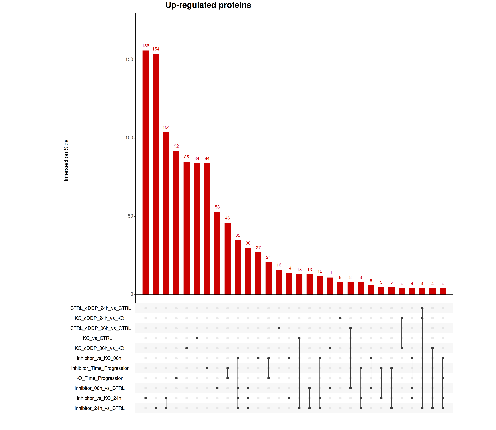<!-- -->

``` r
# 2. Create a binary dataframe for DOWN-regulated proteins
# This turns all -1s to 1 (meaning "yes, it is down-regulated"), and everything else to 0
down_matrix <- as.data.frame((results_matrix == -1) * 1)
downplot <- grid.grabExpr(
  print(upset(down_matrix,
              nsets = 11,             
              nintersects = 30,       
              order.by = "freq",      
              main.bar.color = "blue", 
              sets.bar.color = "gray30",
              text.scale = 1.5))
)
```

    ## Warning in grabDL(warn, wrap, wrap.grobs, ...): one or more grobs overwritten
    ## (grab WILL not be faithful; try 'wrap.grobs = TRUE')

``` r
grid.arrange(downplot,
             vp = viewport(x = 0.42),
             top = textGrob("Down-regulated proteins", 
                            #x = 0.62, just = "center",
                            gp = gpar(fontsize = 18, fontface = "bold")))
```

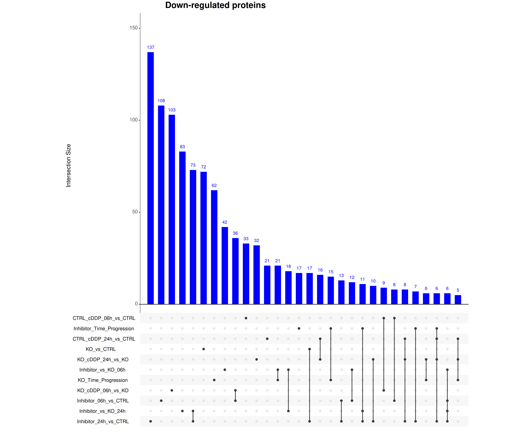<!-- -->

# Inhibitor vs KO

Differentially expressed proteins (DEPs) in the chemical inhibitor
(JNK-IN-8) against the genetic Knockout comparison at both 6-hour and
24-hour timepoints.

``` r
sig_proteins_06h <- rownames(results_matrix)[results_matrix[, "Inhibitor_vs_KO_06h"] != 0]
sig_proteins_24h <- rownames(results_matrix)[results_matrix[, "Inhibitor_vs_KO_24h"] != 0]

# ── Find the Shared Intersect ────────────────────────────────────────
shared_proteins <- intersect(sig_proteins_06h, sig_proteins_24h)

cat("DE Proteins at 6h : ", length(sig_proteins_06h), "\n")
```

    ## DE Proteins at 6h :  257

``` r
cat("DE Proteins at 24h: ", length(sig_proteins_24h), "\n")
```

    ## DE Proteins at 24h:  623

``` r
cat("Shared DE Proteins: ", length(shared_proteins), "\n")
```

    ## Shared DE Proteins:  115

``` r
# ── Extract Fold-Changes for the Shared Proteins ─────────────────────
# This creates a clean table showing how these shared proteins behave over time
shared_df <- data.frame(
  Protein = shared_proteins,
  logFC_06h = fit2$coefficients[shared_proteins, "Inhibitor_vs_KO_06h"],
  logFC_24h = fit2$coefficients[shared_proteins, "Inhibitor_vs_KO_24h"]
)

# write.csv(shared_df, here("Shared_Inhibitor_vs_KO_Proteins.csv"), row.names = FALSE)
```

# ven

Visually quantifies the exact number of shared, core biological targets
overlapping between the early (6h) and late (24h) inhibitor/KO response
profiles.

``` r
# Turn off the default automatic logging file creation that VennDiagram does
options(liftoff.x = FALSE)
futile.logger::flog.threshold(futile.logger::ERROR, name = "VennDiagramLogger")
```

    ## NULL

``` r
# Calculate the unique numbers for the non-overlapping segments

grid.newpage()
venn_object <- draw.pairwise.venn(
  area1 = length(sig_proteins_06h),        # Total size of first group (6h)
  area2 = length(sig_proteins_24h),        # Total size of second group (24h)
  cross.area = length(shared_proteins),   # Shared intersect size
  
  category = c("Inhibitor vs KO\n(6h Early Response)", "Inhibitor vs KO\n(24h Late Response)"),
  
  # ── Aesthetics & Styling ──────────────────────────────────────────────────
  fill = c("#EF5350", "#42A5F5"),      # Muted Red for 6h, Muted Blue for 24h
  alpha = c(0.5, 0.5),                 # Transparency to see the overlap clearly
  col = c("#B71C1C", "#0D47A1"),       # Darker rims for crisp borders
  lwd = 2,                             # Border line width
  
  # Text font sizes and positions
  cat.pos = c(-20, 20),                # Rotates labels outward so they don't hit the bubbles
  cat.dist = c(0.05, 0.05),            # Distance of labels from the circles
  cat.col = c("#B71C1C", "#0D47A1"),   # Matches label text color to their circles
  cat.fontface = "bold",
  cat.fontfamily = "sans",
  
  label.col = "black",                 # Numbers color inside the circles
  fontface = "bold",
  fontfamily = "sans",
  cex = 1.5,                           # Inside numbers size
  cat.cex = 1.2                        # Label text size
)

# Add a clean main plot title
grid.text("JNK-IN-8 Treatment vs Genetic c-Jun KO", 
          x = 0.5, y = 0.95, 
          gp = gpar(fontface = "bold", fontsize = 16, fontfamily = "sans"))
```

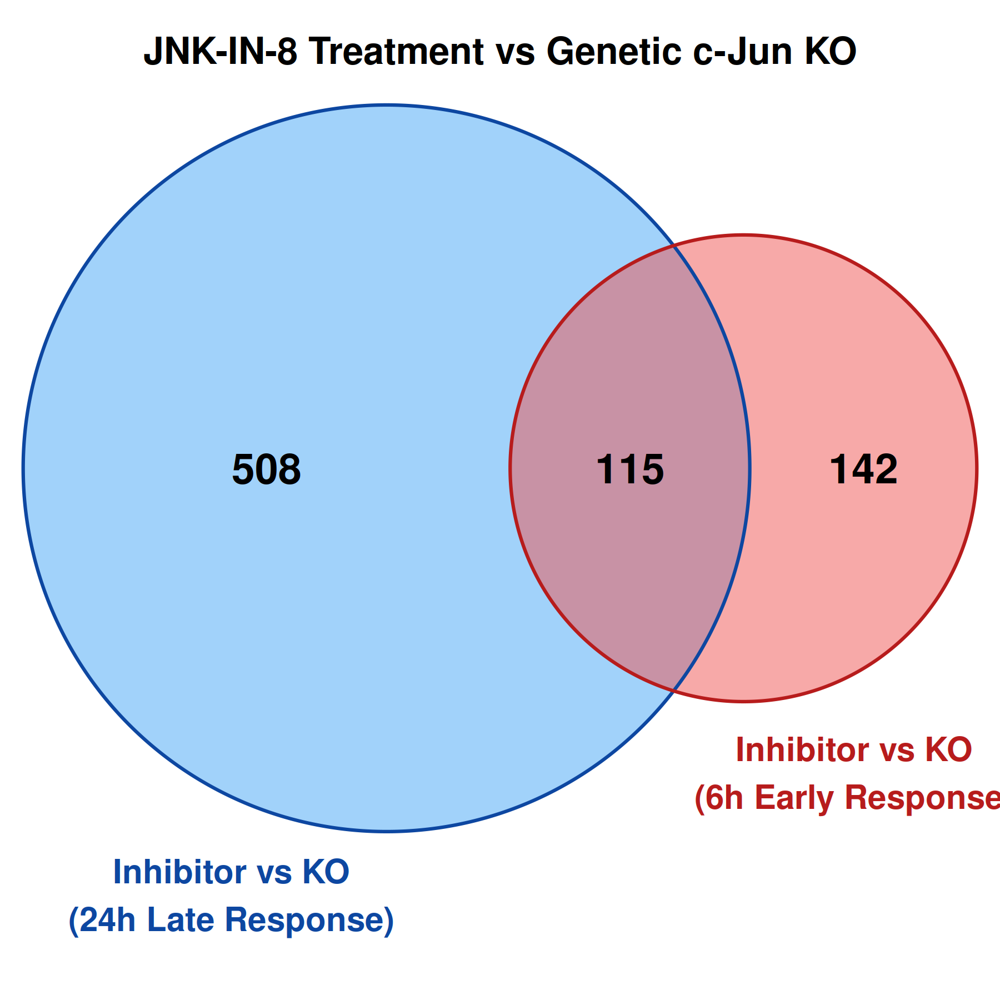<!-- -->

# Reactome Enrichment (shared Protein)

Feeds the highly specific “shared intersect” proteins into a Reactome
pathway analysis.

``` r
clean_proteins <- shared_df$Protein |> 
  strsplit(split = ";") |> 
  unlist() |> 
  unique()

entrez_conversion <- bitr(
  clean_proteins, 
  fromType = "UNIPROT", 
  toType   = "ENTREZID", 
  OrgDb    = org.Hs.eg.db
)
```

    ## 'select()' returned 1:many mapping between keys and columns

``` r
reactome_genes <- entrez_conversion$ENTREZID

# Run Reactome Pathway Enrichment
ego_reactome <- enrichPathway(
  gene          = reactome_genes,
  organism      = "human",
  pAdjustMethod = "BH",
  pvalueCutoff  = 0.01,
  readable      = TRUE # Automatically converts Entrez IDs back to gene symbols in the final table
)

if (!is.null(ego_reactome) && nrow(ego_reactome@result) > 0) {
  
  # 1. Grab the default dotplot data structure
  plot_data <- as.data.frame(ego_reactome) |> 
    head(15) |> 
    mutate(
      # ── CRITICAL STEP: Convert the "17/125" string into a true decimal ──
      # We parse the fraction text and evaluate it mathematically
      GeneRatio_num = sapply(GeneRatio, function(x) eval(parse(text = x))),
      
      # Wrap long pathway text dynamically
      Description = stringr::str_wrap(Description, width = 40),
      
      # ── FIXED: Order by our new numeric decimal column ──
      Description = reorder(Description, GeneRatio_num)
    )
  
  # 2. Build the polished ggplot (Mapping 'x' to our new numeric variable)
  ggplot(plot_data, aes(x = GeneRatio_num, y = Description, size = Count, color = p.adjust)) +
    geom_point(alpha = 0.85, stroke = 0.6, shape = 21, aes(fill = p.adjust)) +
    
    # Clean up the numeric x-axis labels to look like standard percentages or clean decimals
    scale_x_continuous(labels = scales::label_number(accuracy = 0.001)) +
    
    # Custom high-contrast color profile for clarity
    scale_color_gradient(low = "#B71C1C", high = "#0D47A1", 
                         labels = scales::scientific_format(digits = 2)) +
    scale_fill_gradient(low = "#EF5350", high = "#42A5F5", guide = "none") +
    
    # Scale bubble sizing proportionally
    scale_size_continuous(range = c(4, 9)) +
    
    labs(
      title = "Reactome Pathway Enrichment",
      subtitle = "Shared Intersect Between Early (6h) and Late (24h) Response",
      x = "Gene Ratio",
      y = NULL,
      size = "Protein Count",
      color = "Adjusted p-value"
    ) +
    theme_bw(base_size = 12) +
    theme(
      plot.title        = element_text(face = "bold", size = 14),
      plot.subtitle     = element_text(size = 11, color = "grey40"),
      axis.title        = element_text(face = "bold"),
      axis.text.y       = element_text(color = "black", lineheight = 0.85),
      axis.text.x       = element_text(color = "black"),
      panel.grid.minor  = element_blank(),
      legend.title      = element_text(face = "bold", size = 10),
      legend.background = element_blank()
    )
}
```

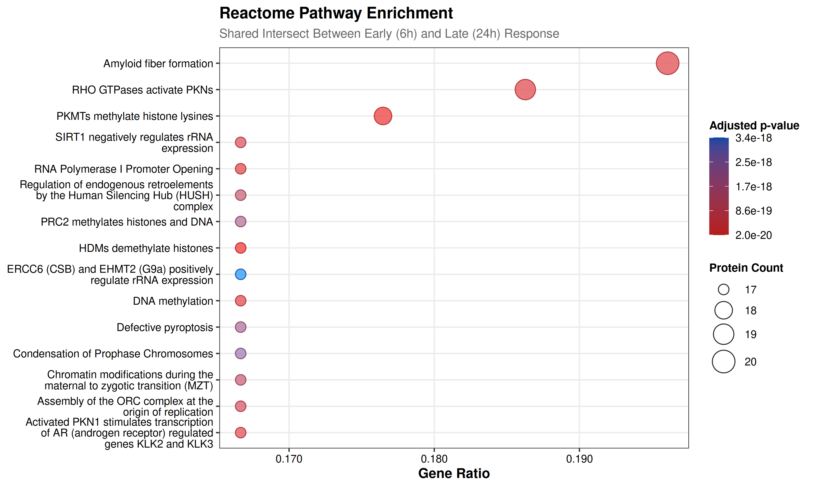<!-- -->
