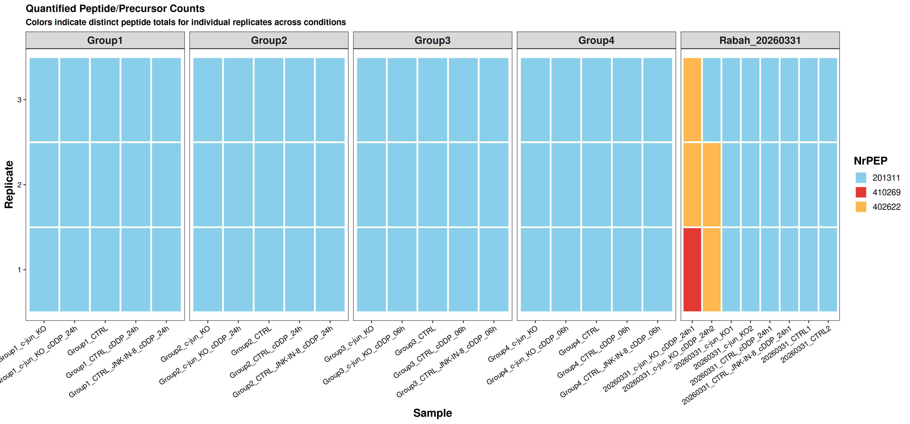
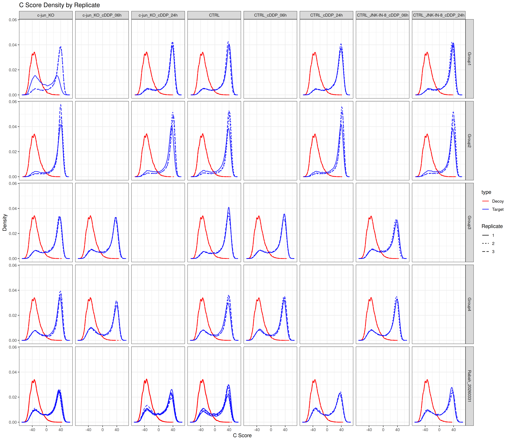
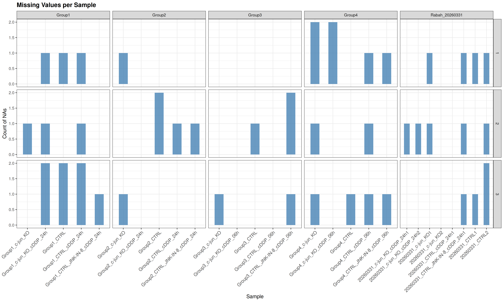
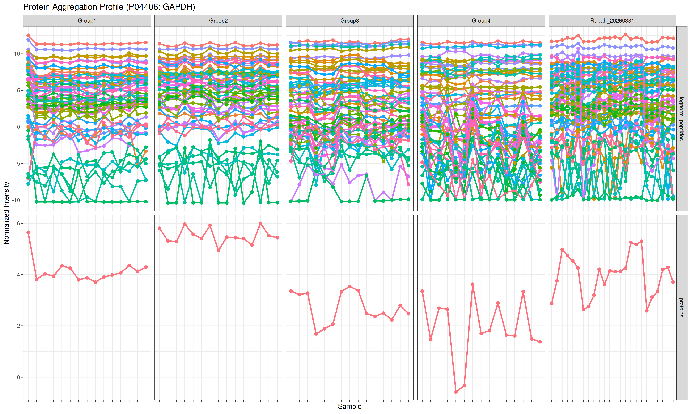
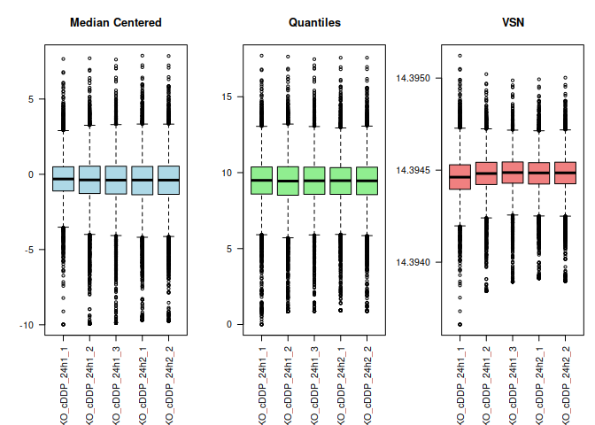
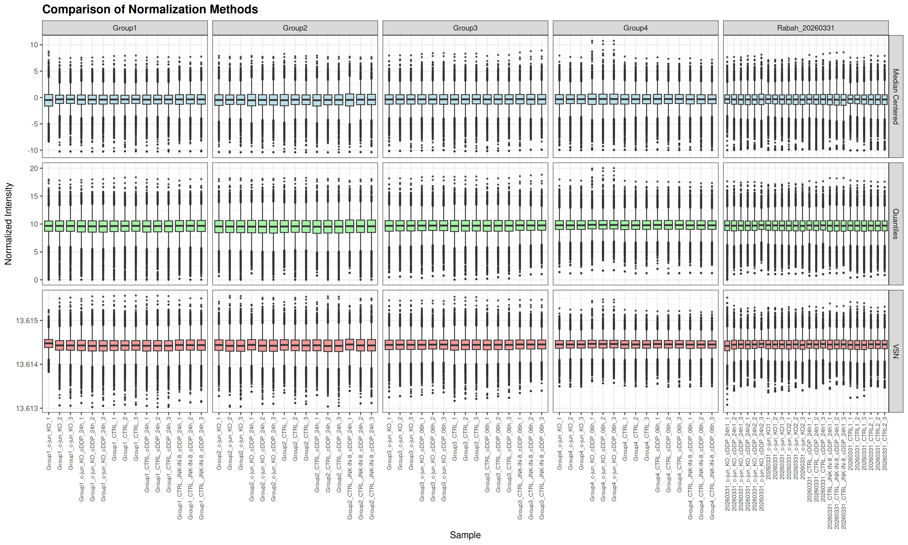
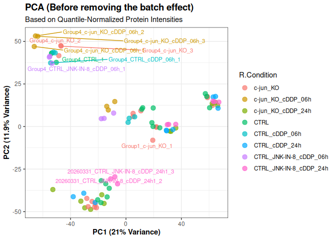
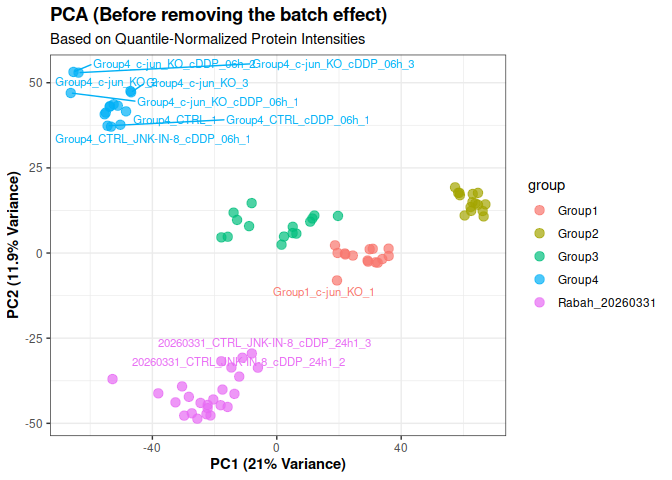
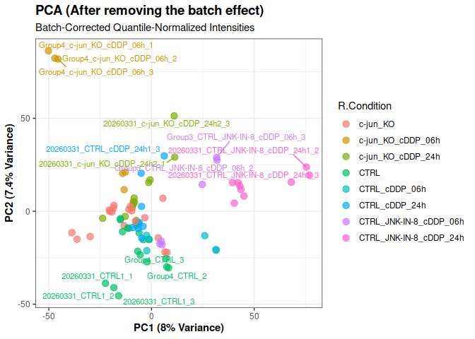
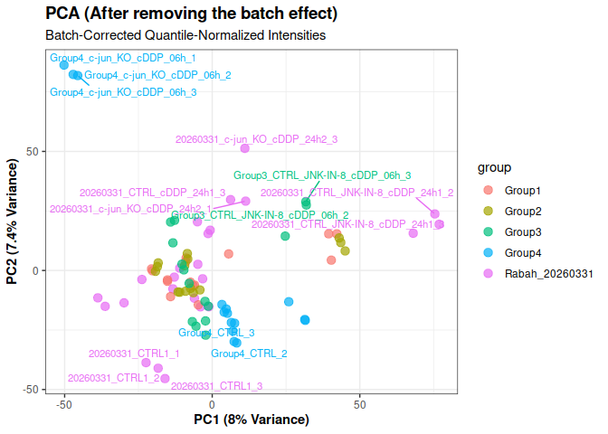

SpectroNaut_analysis
================
peyman
2026-06-01

# Packages

``` r
library(knitr)
library(data.table)
library(tidyverse)
library(ggplot2)
library(ggrepel)
library(QFeatures)
library(SummarizedExperiment)
library(limma)
```

# Load Spectronaut file

``` r
setwd('~/Desktop/proj/MsProteomics/')

df.main <- fread("./20260524/Filtered_Spectronaut_Report.tsv")

df.main <- df.main %>%
  filter(!R.FileName%in%c("R.FileName", "Centroid"))%>%
  mutate(SampleID = str_remove(R.FileName, "_[^_]*$"),
         EG.IsDecoy = as.logical(toupper(EG.IsDecoy)))%>%
  as.data.frame()

filenames <- strsplit(df.main$R.FileName, split = '_')
df.main$group <- unlist(lapply(X = filenames,
                               FUN = function(x){return(x[1])}))

df.main$Rep <- unlist(lapply(X = filenames,
                               FUN = function(x){return(x[length(x)])}))

table(df.main$group)
```

    ## 
    ## 20260331   Group1   Group2   Group3   Group4 
    ##  5845666  3019665  3019665  3019665  3019665

``` r
rabahIdx <- which(df.main$group=='20260331')
df.main$group[rabahIdx] <- paste0('Rabah_', df.main$group[rabahIdx])
table(df.main$group)
```

    ## 
    ##         Group1         Group2         Group3         Group4 Rabah_20260331 
    ##        3019665        3019665        3019665        3019665        5845666

``` r
rm(filenames, rabahIdx)
gc()
```

    ##             used   (Mb) gc trigger   (Mb)  max used   (Mb)
    ## Ncells  47408582 2531.9  135976904 7262.0 100271380 5355.1
    ## Vcells 425958814 3249.9  863018271 6584.4 863018267 6584.4

``` r
colnames(df.main)
```

    ##  [1] "EG.PrecursorId"       "R.FileName"           "R.Condition"         
    ##  [4] "R.Replicate"          "FG.Quantity"          "PEP.StrippedSequence"
    ##  [7] "PG.ProteinGroups"     "EG.PEP"               "EG.Cscore"           
    ## [10] "EG.IsDecoy"           "SampleID"             "group"               
    ## [13] "Rep"

``` r
metaData <- df.main %>%
  select(R.FileName, SampleID, R.Condition, group, Rep) %>%
  group_by(R.FileName, Rep)%>%
  mutate(NrPEP = as.factor(n()))%>%
  distinct()%>%
  as.data.frame()


write.csv(metaData, 'metaData.csv', row.names=FALSE)
```

# Nr peptides

``` r
#  metaData <- read.csv('metaData.csv')

p <- ggplot(metaData, aes(y = Rep, x = SampleID, fill = NrPEP)) +
  geom_tile(color = "white", linewidth = 1) +
  facet_wrap(~ group, scales = "free_x", ncol = 5) +
  scale_fill_manual(values = c("201311" = "skyblue",  
                               "402622" = "#FFB74D",  
                               "410269" = "#E53935")) + 
  theme_bw() +
  theme(
    strip.text = element_text(size = 12, face = "bold"),
    panel.grid = element_blank(),
    axis.text.x = element_text(angle = 35, vjust = 1, hjust = 1, colour = 'black'),
    axis.text.y = element_text(colour = 'black'),
    axis.title = element_text(face = 'bold', size = 13),
    legend.title = element_text(face = 'bold', size = 13, colour = 'black'),
    legend.text = element_text(size = 10, colour = 'black'),
    title = element_text(face = 'bold', size = 10, colour = 'black')
  ) +
  labs(
    title = "Quantified Peptide/Precursor Counts",
    subtitle = "Colors indicate distinct peptide totals for individual replicates across conditions",
    y = "Replicate",
    x = "Sample",
    fill = "NrPEP"
  )

p
```

<!-- -->

``` r
#  ggsave("HeatMap_NrPEP.png", p, width = 8, height = 5, dpi = 300)
```

# Decoy ~ Target

``` r
df.main <- df.main %>%
  mutate(
  EG.Cscore = as.numeric(gsub(",", ".", EG.Cscore)),
  EG.Cscore = as.numeric(EG.Cscore),
  group = as.factor(group),
  type = ifelse(EG.IsDecoy, "Decoy", "Target")
  ) %>%
  as.data.frame()

table(df.main$EG.IsDecoy)
```

    ## 
    ##    FALSE     TRUE 
    ## 16307729  1616597

``` r
tab <- df.main %>%
  group_by(R.FileName) %>%
  summarise(
    Nr_Decoy = sum(EG.IsDecoy),
    Total_Precursor = n(),
    Percent_Decoy = round(100 * mean(EG.IsDecoy), 2)
  )

kable(tab)
```

| R.FileName                         | Nr_Decoy | Total_Precursor | Percent_Decoy |
|:-----------------------------------|---------:|----------------:|--------------:|
| 20260331_CTRL1_1                   |    18156 |          201311 |          9.02 |
| 20260331_CTRL1_2                   |    18156 |          201311 |          9.02 |
| 20260331_CTRL1_3                   |    18156 |          201311 |          9.02 |
| 20260331_CTRL2_1                   |    18156 |          201311 |          9.02 |
| 20260331_CTRL2_2                   |    18156 |          201311 |          9.02 |
| 20260331_CTRL2_3                   |    18156 |          201311 |          9.02 |
| 20260331_CTRL_JNK-IN-8_cDDP_24h1_1 |    18156 |          201311 |          9.02 |
| 20260331_CTRL_JNK-IN-8_cDDP_24h1_2 |    18156 |          201311 |          9.02 |
| 20260331_CTRL_JNK-IN-8_cDDP_24h1_3 |    18156 |          201311 |          9.02 |
| 20260331_CTRL_cDDP_24h1_1          |    18156 |          201311 |          9.02 |
| 20260331_CTRL_cDDP_24h1_2          |    18156 |          201311 |          9.02 |
| 20260331_CTRL_cDDP_24h1_3          |    18156 |          201311 |          9.02 |
| 20260331_c-jun_KO1_1               |    18156 |          201311 |          9.02 |
| 20260331_c-jun_KO1_2               |    18156 |          201311 |          9.02 |
| 20260331_c-jun_KO1_3               |    18156 |          201311 |          9.02 |
| 20260331_c-jun_KO2_1               |    18156 |          201311 |          9.02 |
| 20260331_c-jun_KO2_2               |    18156 |          201311 |          9.02 |
| 20260331_c-jun_KO2_3               |    18156 |          201311 |          9.02 |
| 20260331_c-jun_KO_cDDP_24h1_1      |    37025 |          410269 |          9.02 |
| 20260331_c-jun_KO_cDDP_24h1_2      |    36312 |          402622 |          9.02 |
| 20260331_c-jun_KO_cDDP_24h1_3      |    36312 |          402622 |          9.02 |
| 20260331_c-jun_KO_cDDP_24h2_1      |    36312 |          402622 |          9.02 |
| 20260331_c-jun_KO_cDDP_24h2_2      |    36312 |          402622 |          9.02 |
| 20260331_c-jun_KO_cDDP_24h2_3      |    18156 |          201311 |          9.02 |
| Group1_CTRL_1                      |    18156 |          201311 |          9.02 |
| Group1_CTRL_2                      |    18156 |          201311 |          9.02 |
| Group1_CTRL_3                      |    18156 |          201311 |          9.02 |
| Group1_CTRL_JNK-IN-8_cDDP_24h_1    |    18156 |          201311 |          9.02 |
| Group1_CTRL_JNK-IN-8_cDDP_24h_2    |    18156 |          201311 |          9.02 |
| Group1_CTRL_JNK-IN-8_cDDP_24h_3    |    18156 |          201311 |          9.02 |
| Group1_CTRL_cDDP_24h_1             |    18156 |          201311 |          9.02 |
| Group1_CTRL_cDDP_24h_2             |    18156 |          201311 |          9.02 |
| Group1_CTRL_cDDP_24h_3             |    18156 |          201311 |          9.02 |
| Group1_c-jun_KO_1                  |    18156 |          201311 |          9.02 |
| Group1_c-jun_KO_2                  |    18156 |          201311 |          9.02 |
| Group1_c-jun_KO_3                  |    18156 |          201311 |          9.02 |
| Group1_c-jun_KO_cDDP_24h_1         |    18156 |          201311 |          9.02 |
| Group1_c-jun_KO_cDDP_24h_2         |    18156 |          201311 |          9.02 |
| Group1_c-jun_KO_cDDP_24h_3         |    18156 |          201311 |          9.02 |
| Group2_CTRL_1                      |    18156 |          201311 |          9.02 |
| Group2_CTRL_2                      |    18156 |          201311 |          9.02 |
| Group2_CTRL_3                      |    18156 |          201311 |          9.02 |
| Group2_CTRL_JNK-IN-8_cDDP_24h_1    |    18156 |          201311 |          9.02 |
| Group2_CTRL_JNK-IN-8_cDDP_24h_2    |    18156 |          201311 |          9.02 |
| Group2_CTRL_JNK-IN-8_cDDP_24h_3    |    18156 |          201311 |          9.02 |
| Group2_CTRL_cDDP_24h_1             |    18156 |          201311 |          9.02 |
| Group2_CTRL_cDDP_24h_2             |    18156 |          201311 |          9.02 |
| Group2_CTRL_cDDP_24h_3             |    18156 |          201311 |          9.02 |
| Group2_c-jun_KO_1                  |    18156 |          201311 |          9.02 |
| Group2_c-jun_KO_2                  |    18156 |          201311 |          9.02 |
| Group2_c-jun_KO_3                  |    18156 |          201311 |          9.02 |
| Group2_c-jun_KO_cDDP_24h_1         |    18156 |          201311 |          9.02 |
| Group2_c-jun_KO_cDDP_24h_2         |    18156 |          201311 |          9.02 |
| Group2_c-jun_KO_cDDP_24h_3         |    18156 |          201311 |          9.02 |
| Group3_CTRL_1                      |    18156 |          201311 |          9.02 |
| Group3_CTRL_2                      |    18156 |          201311 |          9.02 |
| Group3_CTRL_3                      |    18156 |          201311 |          9.02 |
| Group3_CTRL_JNK-IN-8_cDDP_06h_1    |    18156 |          201311 |          9.02 |
| Group3_CTRL_JNK-IN-8_cDDP_06h_2    |    18156 |          201311 |          9.02 |
| Group3_CTRL_JNK-IN-8_cDDP_06h_3    |    18156 |          201311 |          9.02 |
| Group3_CTRL_cDDP_06h_1             |    18156 |          201311 |          9.02 |
| Group3_CTRL_cDDP_06h_2             |    18156 |          201311 |          9.02 |
| Group3_CTRL_cDDP_06h_3             |    18156 |          201311 |          9.02 |
| Group3_c-jun_KO_1                  |    18156 |          201311 |          9.02 |
| Group3_c-jun_KO_2                  |    18156 |          201311 |          9.02 |
| Group3_c-jun_KO_3                  |    18156 |          201311 |          9.02 |
| Group3_c-jun_KO_cDDP_06h_1         |    18156 |          201311 |          9.02 |
| Group3_c-jun_KO_cDDP_06h_2         |    18156 |          201311 |          9.02 |
| Group3_c-jun_KO_cDDP_06h_3         |    18156 |          201311 |          9.02 |
| Group4_CTRL_1                      |    18156 |          201311 |          9.02 |
| Group4_CTRL_2                      |    18156 |          201311 |          9.02 |
| Group4_CTRL_3                      |    18156 |          201311 |          9.02 |
| Group4_CTRL_JNK-IN-8_cDDP_06h_1    |    18156 |          201311 |          9.02 |
| Group4_CTRL_JNK-IN-8_cDDP_06h_2    |    18156 |          201311 |          9.02 |
| Group4_CTRL_JNK-IN-8_cDDP_06h_3    |    18156 |          201311 |          9.02 |
| Group4_CTRL_cDDP_06h_1             |    18156 |          201311 |          9.02 |
| Group4_CTRL_cDDP_06h_2             |    18156 |          201311 |          9.02 |
| Group4_CTRL_cDDP_06h_3             |    18156 |          201311 |          9.02 |
| Group4_c-jun_KO_1                  |    18156 |          201311 |          9.02 |
| Group4_c-jun_KO_2                  |    18156 |          201311 |          9.02 |
| Group4_c-jun_KO_3                  |    18156 |          201311 |          9.02 |
| Group4_c-jun_KO_cDDP_06h_1         |    18156 |          201311 |          9.02 |
| Group4_c-jun_KO_cDDP_06h_2         |    18156 |          201311 |          9.02 |
| Group4_c-jun_KO_cDDP_06h_3         |    18156 |          201311 |          9.02 |

``` r
message("The average number of Decoys in all samples is:  ", mean(tab$Percent_Decoy), '%')
```

    ## The average number of Decoys in all samples is:  9.02%

``` r
sum(is.na(df.main$EG.Cscore))
```

    ## [1] 51

``` r
density_data <- df.main %>%
  group_by(R.FileName, type) %>%
  reframe(
    Score = density(EG.Cscore, na.rm = TRUE)$x,
    Density = density(EG.Cscore, na.rm = TRUE)$y
  )%>%
  as.data.frame()%>%
  left_join(metaData, by = "R.FileName")
  


p <- ggplot(density_data, aes(
  x = Score, 
  y = Density, 
  color = type, 
  group = interaction(R.FileName, type) 
)) +
  geom_line(aes(linetype = as.character(Rep)), linewidth = 0.7, alpha = 0.8) +
  facet_grid(group ~ R.Condition) +
  scale_color_manual(values = c(Decoy = "red", Target = "blue")) +
  labs(
    title = "C Score Density by Replicate",
    x = "C Score", 
    y = "Density",
    linetype = "Replicate" 
  ) +
  theme_bw() 


p
```

<!-- -->

``` r
# ggsave("Cscore Density.png", p, width = 8, height = 5, dpi = 300)
rm(density_data)
gc()
```

    ##             used   (Mb) gc trigger   (Mb)  max used   (Mb)
    ## Ncells  36316937 1939.6  108781524 5809.6 100271380 5355.1
    ## Vcells 391362133 2985.9  863018271 6584.4 863018267 6584.4

# SE object

``` r
quant_wide <- df.main %>%
  select(EG.PrecursorId, R.FileName, FG.Quantity) %>%
  mutate(FG.Quantity = as.numeric(gsub(",", ".", FG.Quantity))) %>%
  pivot_wider(
    names_from = R.FileName,
    values_from = FG.Quantity,
    values_fn = max # Resolves any rare duplicate precursor entries in a single run
  ) %>%
  as.data.frame()

rownames(quant_wide) <- quant_wide$EG.PrecursorId
quant_matrix <- as.matrix(quant_wide[, -1]) 


col_data <- df.main %>%
  select(R.FileName, SampleID, R.Condition, Rep, group) %>%
  distinct() %>%
  as.data.frame()

rownames(col_data) <- col_data$R.FileName

quant_matrix <- quant_matrix[, rownames(col_data)] # *** important ***


row_data <- df.main %>%
  select(
    EG.PrecursorId,
    Sequence = PEP.StrippedSequence,
    Proteins = PG.ProteinGroups,
    PEP = EG.PEP,
    Score = EG.Cscore,
    IsDecoy = EG.IsDecoy
  ) %>%
  mutate(
    PEP = as.numeric(gsub(",", ".", PEP))) %>%
  group_by(EG.PrecursorId) %>%
  dplyr::slice(1) %>% # Take the metadata from the first appearance of the precursor
  ungroup() %>%
  as.data.frame()


rownames(row_data) <- row_data$EG.PrecursorId

# CRITICAL: Ensure the rows of the metadata match the rows of the matrix exactly
row_data <- row_data[rownames(quant_matrix), ] # *** important ***


spectronaut_se <- SummarizedExperiment(
  assays = list(intensity = quant_matrix),
  colData = DataFrame(col_data),
  rowData = DataFrame(row_data)
)

head(assay(spectronaut_se))
```

    ##                               20260331_c-jun_KO_cDDP_24h1_1
    ## _DGSASEVPSELSERPK_.3                             1487.65710
    ## _DGSASEVPSELSERPK_.2                               23.64510
    ## _NEFTAWYR_.2                                       80.52678
    ## _GFYVETVVTYKEDFVPNTEK_.3                           58.53152
    ## _MQLVQESEEK_.2                                    372.72836
    ## _M[Oxidation (M)]QLVQESEEK_.2                     146.92633
    ##                               20260331_c-jun_KO_cDDP_24h1_2
    ## _DGSASEVPSELSERPK_.3                             1361.61829
    ## _DGSASEVPSELSERPK_.2                               61.31200
    ## _NEFTAWYR_.2                                      263.87909
    ## _GFYVETVVTYKEDFVPNTEK_.3                            1.00000
    ## _MQLVQESEEK_.2                                     25.63280
    ## _M[Oxidation (M)]QLVQESEEK_.2                      44.75975
    ##                               20260331_c-jun_KO_cDDP_24h1_3
    ## _DGSASEVPSELSERPK_.3                             863.042053
    ## _DGSASEVPSELSERPK_.2                               1.000000
    ## _NEFTAWYR_.2                                     104.797485
    ## _GFYVETVVTYKEDFVPNTEK_.3                          10.718036
    ## _MQLVQESEEK_.2                                     3.323514
    ## _M[Oxidation (M)]QLVQESEEK_.2                    160.387253
    ##                               20260331_c-jun_KO_cDDP_24h2_1
    ## _DGSASEVPSELSERPK_.3                             1494.40735
    ## _DGSASEVPSELSERPK_.2                               18.52711
    ## _NEFTAWYR_.2                                      532.80713
    ## _GFYVETVVTYKEDFVPNTEK_.3                           42.44754
    ## _MQLVQESEEK_.2                                     15.98656
    ## _M[Oxidation (M)]QLVQESEEK_.2                     143.57387
    ##                               20260331_c-jun_KO_cDDP_24h2_2
    ## _DGSASEVPSELSERPK_.3                             1688.79846
    ## _DGSASEVPSELSERPK_.2                               34.80320
    ## _NEFTAWYR_.2                                      314.94266
    ## _GFYVETVVTYKEDFVPNTEK_.3                           25.55131
    ## _MQLVQESEEK_.2                                     82.50373
    ## _M[Oxidation (M)]QLVQESEEK_.2                     203.80109
    ##                               20260331_c-jun_KO_cDDP_24h2_3
    ## _DGSASEVPSELSERPK_.3                            1419.731079
    ## _DGSASEVPSELSERPK_.2                              23.645100
    ## _NEFTAWYR_.2                                      80.526779
    ## _GFYVETVVTYKEDFVPNTEK_.3                           1.556046
    ## _MQLVQESEEK_.2                                    53.287964
    ## _M[Oxidation (M)]QLVQESEEK_.2                    146.926331
    ##                               20260331_c-jun_KO1_1 20260331_c-jun_KO1_2
    ## _DGSASEVPSELSERPK_.3                    2281.43994           2243.84912
    ## _DGSASEVPSELSERPK_.2                      84.96895             63.51929
    ## _NEFTAWYR_.2                             665.66162            607.68689
    ## _GFYVETVVTYKEDFVPNTEK_.3                   1.00000              1.00000
    ## _MQLVQESEEK_.2                           492.25943            603.67761
    ## _M[Oxidation (M)]QLVQESEEK_.2              1.00000             38.82359
    ##                               20260331_c-jun_KO1_3 20260331_c-jun_KO2_1
    ## _DGSASEVPSELSERPK_.3                   1400.261597           3002.72290
    ## _DGSASEVPSELSERPK_.2                     96.947685              1.00000
    ## _NEFTAWYR_.2                            974.801270            658.31451
    ## _GFYVETVVTYKEDFVPNTEK_.3                  1.063838            128.96077
    ## _MQLVQESEEK_.2                           86.631042            159.36005
    ## _M[Oxidation (M)]QLVQESEEK_.2            82.109177             21.68694
    ##                               20260331_c-jun_KO2_2 20260331_c-jun_KO2_3
    ## _DGSASEVPSELSERPK_.3                    2991.29712           2554.06934
    ## _DGSASEVPSELSERPK_.2                      26.67040             10.87415
    ## _NEFTAWYR_.2                             277.07974            449.68301
    ## _GFYVETVVTYKEDFVPNTEK_.3                  86.63033             60.19222
    ## _MQLVQESEEK_.2                           409.79218            211.92389
    ## _M[Oxidation (M)]QLVQESEEK_.2             25.34366             83.25562
    ##                               20260331_CTRL_cDDP_24h1_1
    ## _DGSASEVPSELSERPK_.3                         1726.20532
    ## _DGSASEVPSELSERPK_.2                           17.56113
    ## _NEFTAWYR_.2                                   90.83603
    ## _GFYVETVVTYKEDFVPNTEK_.3                       25.19090
    ## _MQLVQESEEK_.2                                 43.85864
    ## _M[Oxidation (M)]QLVQESEEK_.2                  43.97757
    ##                               20260331_CTRL_cDDP_24h1_2
    ## _DGSASEVPSELSERPK_.3                         1954.53687
    ## _DGSASEVPSELSERPK_.2                           91.05584
    ## _NEFTAWYR_.2                                  294.11340
    ## _GFYVETVVTYKEDFVPNTEK_.3                       14.55124
    ## _MQLVQESEEK_.2                                209.65289
    ## _M[Oxidation (M)]QLVQESEEK_.2                   1.00000
    ##                               20260331_CTRL_cDDP_24h1_3
    ## _DGSASEVPSELSERPK_.3                         261.908844
    ## _DGSASEVPSELSERPK_.2                          32.049229
    ## _NEFTAWYR_.2                                 118.557335
    ## _GFYVETVVTYKEDFVPNTEK_.3                       1.270467
    ## _MQLVQESEEK_.2                                74.107689
    ## _M[Oxidation (M)]QLVQESEEK_.2                 57.205276
    ##                               20260331_CTRL_JNK-IN-8_cDDP_24h1_1
    ## _DGSASEVPSELSERPK_.3                                 2063.398682
    ## _DGSASEVPSELSERPK_.2                                   35.806633
    ## _NEFTAWYR_.2                                           63.514183
    ## _GFYVETVVTYKEDFVPNTEK_.3                                1.062366
    ## _MQLVQESEEK_.2                                        368.636139
    ## _M[Oxidation (M)]QLVQESEEK_.2                         192.505829
    ##                               20260331_CTRL_JNK-IN-8_cDDP_24h1_2
    ## _DGSASEVPSELSERPK_.3                                  1935.79443
    ## _DGSASEVPSELSERPK_.2                                     1.00000
    ## _NEFTAWYR_.2                                           237.23714
    ## _GFYVETVVTYKEDFVPNTEK_.3                                43.35216
    ## _MQLVQESEEK_.2                                          17.05524
    ## _M[Oxidation (M)]QLVQESEEK_.2                           72.40327
    ##                               20260331_CTRL_JNK-IN-8_cDDP_24h1_3
    ## _DGSASEVPSELSERPK_.3                                 2108.697510
    ## _DGSASEVPSELSERPK_.2                                   91.904106
    ## _NEFTAWYR_.2                                          129.933151
    ## _GFYVETVVTYKEDFVPNTEK_.3                               99.921638
    ## _MQLVQESEEK_.2                                          1.012578
    ## _M[Oxidation (M)]QLVQESEEK_.2                          86.642288
    ##                               20260331_CTRL1_1 20260331_CTRL1_2
    ## _DGSASEVPSELSERPK_.3                1823.77161        1548.0773
    ## _DGSASEVPSELSERPK_.2                  32.46326         106.9824
    ## _NEFTAWYR_.2                        1567.29785         950.3445
    ## _GFYVETVVTYKEDFVPNTEK_.3              61.66925         188.7626
    ## _MQLVQESEEK_.2                       539.92987         508.6889
    ## _M[Oxidation (M)]QLVQESEEK_.2          1.00000           1.0000
    ##                               20260331_CTRL1_3 20260331_CTRL2_1
    ## _DGSASEVPSELSERPK_.3               2055.517334      2262.067139
    ## _DGSASEVPSELSERPK_.2                  1.000000         1.272825
    ## _NEFTAWYR_.2                        710.534058       631.231384
    ## _GFYVETVVTYKEDFVPNTEK_.3              1.000000         2.354377
    ## _MQLVQESEEK_.2                      539.209900       271.546875
    ## _M[Oxidation (M)]QLVQESEEK_.2         8.723172         1.366212
    ##                               20260331_CTRL2_2 20260331_CTRL2_3
    ## _DGSASEVPSELSERPK_.3               1409.293945      2234.377441
    ## _DGSASEVPSELSERPK_.2                  1.022195        11.887184
    ## _NEFTAWYR_.2                        478.011322       350.898956
    ## _GFYVETVVTYKEDFVPNTEK_.3              1.066270         2.177642
    ## _MQLVQESEEK_.2                      349.498474       235.591537
    ## _M[Oxidation (M)]QLVQESEEK_.2        25.855385         8.383930
    ##                               Group1_c-jun_KO_1 Group1_c-jun_KO_2
    ## _DGSASEVPSELSERPK_.3                1081.300049        1826.86523
    ## _DGSASEVPSELSERPK_.2                   7.042112         107.59800
    ## _NEFTAWYR_.2                           3.031282         588.68512
    ## _GFYVETVVTYKEDFVPNTEK_.3               3.271701          19.68232
    ## _MQLVQESEEK_.2                       273.384003         643.80737
    ## _M[Oxidation (M)]QLVQESEEK_.2         22.814970          32.11423
    ##                               Group1_c-jun_KO_3 Group1_c-jun_KO_cDDP_24h_1
    ## _DGSASEVPSELSERPK_.3                 1863.14514                1599.161865
    ## _DGSASEVPSELSERPK_.2                   90.65949                   1.000000
    ## _NEFTAWYR_.2                         1287.80591                 499.102692
    ## _GFYVETVVTYKEDFVPNTEK_.3               30.39939                   5.725753
    ## _MQLVQESEEK_.2                        437.20834                  19.026472
    ## _M[Oxidation (M)]QLVQESEEK_.2          19.06588                   6.415473
    ##                               Group1_c-jun_KO_cDDP_24h_2
    ## _DGSASEVPSELSERPK_.3                          1154.29272
    ## _DGSASEVPSELSERPK_.2                            38.45511
    ## _NEFTAWYR_.2                                   319.77579
    ## _GFYVETVVTYKEDFVPNTEK_.3                        25.38723
    ## _MQLVQESEEK_.2                                 392.94342
    ## _M[Oxidation (M)]QLVQESEEK_.2                   15.98171
    ##                               Group1_c-jun_KO_cDDP_24h_3 Group1_CTRL_1
    ## _DGSASEVPSELSERPK_.3                          1269.49951    1362.33252
    ## _DGSASEVPSELSERPK_.2                            58.61242      71.75465
    ## _NEFTAWYR_.2                                   198.57600     265.16974
    ## _GFYVETVVTYKEDFVPNTEK_.3                        18.29785      10.21957
    ## _MQLVQESEEK_.2                                 314.31445      35.03008
    ## _M[Oxidation (M)]QLVQESEEK_.2                   41.64481      19.30687
    ##                               Group1_CTRL_2 Group1_CTRL_3
    ## _DGSASEVPSELSERPK_.3            1526.103760    1532.69775
    ## _DGSASEVPSELSERPK_.2             103.556297      40.57723
    ## _NEFTAWYR_.2                     723.773193     479.55203
    ## _GFYVETVVTYKEDFVPNTEK_.3          79.058380       1.00000
    ## _MQLVQESEEK_.2                   513.537109     319.07242
    ## _M[Oxidation (M)]QLVQESEEK_.2      2.764884       1.00000
    ##                               Group1_CTRL_cDDP_24h_1 Group1_CTRL_cDDP_24h_2
    ## _DGSASEVPSELSERPK_.3                     1078.400635             914.316833
    ## _DGSASEVPSELSERPK_.2                       78.700989              96.849098
    ## _NEFTAWYR_.2                               66.269478             520.156189
    ## _GFYVETVVTYKEDFVPNTEK_.3                  174.980164              30.287041
    ## _MQLVQESEEK_.2                            450.728027             623.136169
    ## _M[Oxidation (M)]QLVQESEEK_.2               3.510029               2.506633
    ##                               Group1_CTRL_cDDP_24h_3
    ## _DGSASEVPSELSERPK_.3                     1132.783081
    ## _DGSASEVPSELSERPK_.2                      123.647522
    ## _NEFTAWYR_.2                              415.163513
    ## _GFYVETVVTYKEDFVPNTEK_.3                    8.957072
    ## _MQLVQESEEK_.2                            478.754333
    ## _M[Oxidation (M)]QLVQESEEK_.2              22.606920
    ##                               Group1_CTRL_JNK-IN-8_cDDP_24h_1
    ## _DGSASEVPSELSERPK_.3                              1345.895996
    ## _DGSASEVPSELSERPK_.2                                31.024454
    ## _NEFTAWYR_.2                                       405.161133
    ## _GFYVETVVTYKEDFVPNTEK_.3                            44.300289
    ## _MQLVQESEEK_.2                                     499.535797
    ## _M[Oxidation (M)]QLVQESEEK_.2                        7.968593
    ##                               Group1_CTRL_JNK-IN-8_cDDP_24h_2
    ## _DGSASEVPSELSERPK_.3                               1578.31860
    ## _DGSASEVPSELSERPK_.2                                 51.17896
    ## _NEFTAWYR_.2                                       1048.90857
    ## _GFYVETVVTYKEDFVPNTEK_.3                             91.40014
    ## _MQLVQESEEK_.2                                      387.48242
    ## _M[Oxidation (M)]QLVQESEEK_.2                        56.13549
    ##                               Group1_CTRL_JNK-IN-8_cDDP_24h_3 Group2_c-jun_KO_1
    ## _DGSASEVPSELSERPK_.3                              1517.244141        1751.95044
    ## _DGSASEVPSELSERPK_.2                                22.868795         135.95865
    ## _NEFTAWYR_.2                                       700.902283        1782.16235
    ## _GFYVETVVTYKEDFVPNTEK_.3                           129.395889         128.68224
    ## _MQLVQESEEK_.2                                      14.447882         433.74387
    ## _M[Oxidation (M)]QLVQESEEK_.2                        7.327835          11.72724
    ##                               Group2_c-jun_KO_2 Group2_c-jun_KO_3
    ## _DGSASEVPSELSERPK_.3                2101.130371        2107.47168
    ## _DGSASEVPSELSERPK_.2                  70.534378          72.50511
    ## _NEFTAWYR_.2                        1108.214844        1445.45886
    ## _GFYVETVVTYKEDFVPNTEK_.3               2.444177         266.02682
    ## _MQLVQESEEK_.2                       594.901245         711.20160
    ## _M[Oxidation (M)]QLVQESEEK_.2          6.384009           1.00000
    ##                               Group2_c-jun_KO_cDDP_24h_1
    ## _DGSASEVPSELSERPK_.3                          1165.50732
    ## _DGSASEVPSELSERPK_.2                             1.00000
    ## _NEFTAWYR_.2                                  1375.08691
    ## _GFYVETVVTYKEDFVPNTEK_.3                       122.44200
    ## _MQLVQESEEK_.2                                 186.69128
    ## _M[Oxidation (M)]QLVQESEEK_.2                   22.62086
    ##                               Group2_c-jun_KO_cDDP_24h_2
    ## _DGSASEVPSELSERPK_.3                          1430.34961
    ## _DGSASEVPSELSERPK_.2                            28.50748
    ## _NEFTAWYR_.2                                   907.89893
    ## _GFYVETVVTYKEDFVPNTEK_.3                        64.87861
    ## _MQLVQESEEK_.2                                 585.89771
    ## _M[Oxidation (M)]QLVQESEEK_.2                   34.25575
    ##                               Group2_c-jun_KO_cDDP_24h_3 Group2_CTRL_1
    ## _DGSASEVPSELSERPK_.3                          1549.82507    1398.75977
    ## _DGSASEVPSELSERPK_.2                            65.04742      61.95318
    ## _NEFTAWYR_.2                                   817.34778    1346.51599
    ## _GFYVETVVTYKEDFVPNTEK_.3                       227.05107      82.71764
    ## _MQLVQESEEK_.2                                 538.28137     568.22430
    ## _M[Oxidation (M)]QLVQESEEK_.2                   14.08147      24.31628
    ##                               Group2_CTRL_2 Group2_CTRL_3
    ## _DGSASEVPSELSERPK_.3             1930.13513   1860.655762
    ## _DGSASEVPSELSERPK_.2              104.29877     95.749374
    ## _NEFTAWYR_.2                     1136.59717   1493.484741
    ## _GFYVETVVTYKEDFVPNTEK_.3          247.46515    383.510223
    ## _MQLVQESEEK_.2                    523.71478    653.018555
    ## _M[Oxidation (M)]QLVQESEEK_.2       4.28529      7.592391
    ##                               Group2_CTRL_cDDP_24h_1 Group2_CTRL_cDDP_24h_2
    ## _DGSASEVPSELSERPK_.3                     1501.576172             934.658813
    ## _DGSASEVPSELSERPK_.2                       36.607811              80.909897
    ## _NEFTAWYR_.2                             1043.326416            1014.433350
    ## _GFYVETVVTYKEDFVPNTEK_.3                    9.236853             191.396805
    ## _MQLVQESEEK_.2                            520.805054             676.619568
    ## _M[Oxidation (M)]QLVQESEEK_.2               1.000000               5.894477
    ##                               Group2_CTRL_cDDP_24h_3
    ## _DGSASEVPSELSERPK_.3                      1080.67896
    ## _DGSASEVPSELSERPK_.2                        43.07743
    ## _NEFTAWYR_.2                               602.45490
    ## _GFYVETVVTYKEDFVPNTEK_.3                   129.67581
    ## _MQLVQESEEK_.2                             610.93634
    ## _M[Oxidation (M)]QLVQESEEK_.2               19.04416
    ##                               Group2_CTRL_JNK-IN-8_cDDP_24h_1
    ## _DGSASEVPSELSERPK_.3                               2133.11499
    ## _DGSASEVPSELSERPK_.2                                 81.79355
    ## _NEFTAWYR_.2                                       1578.78040
    ## _GFYVETVVTYKEDFVPNTEK_.3                            406.54736
    ## _MQLVQESEEK_.2                                     1013.66394
    ## _M[Oxidation (M)]QLVQESEEK_.2                         1.00000
    ##                               Group2_CTRL_JNK-IN-8_cDDP_24h_2
    ## _DGSASEVPSELSERPK_.3                               2175.17188
    ## _DGSASEVPSELSERPK_.2                                 46.81419
    ## _NEFTAWYR_.2                                       1480.07361
    ## _GFYVETVVTYKEDFVPNTEK_.3                             20.57343
    ## _MQLVQESEEK_.2                                      538.96735
    ## _M[Oxidation (M)]QLVQESEEK_.2                        14.14353
    ##                               Group2_CTRL_JNK-IN-8_cDDP_24h_3 Group3_c-jun_KO_1
    ## _DGSASEVPSELSERPK_.3                               1978.56604        2302.43237
    ## _DGSASEVPSELSERPK_.2                                 79.65299          68.76553
    ## _NEFTAWYR_.2                                       1380.32874         116.22652
    ## _GFYVETVVTYKEDFVPNTEK_.3                            369.68719          66.25474
    ## _MQLVQESEEK_.2                                      664.79218         332.73206
    ## _M[Oxidation (M)]QLVQESEEK_.2                        21.13363          16.90561
    ##                               Group3_c-jun_KO_2 Group3_c-jun_KO_3
    ## _DGSASEVPSELSERPK_.3                 1812.29224        2158.59546
    ## _DGSASEVPSELSERPK_.2                  109.51418          50.53832
    ## _NEFTAWYR_.2                          512.09668         263.00067
    ## _GFYVETVVTYKEDFVPNTEK_.3               46.08426          55.66318
    ## _MQLVQESEEK_.2                         12.43871         273.92081
    ## _M[Oxidation (M)]QLVQESEEK_.2          34.42643          24.75752
    ##                               Group3_c-jun_KO_cDDP_06h_1
    ## _DGSASEVPSELSERPK_.3                         2301.188477
    ## _DGSASEVPSELSERPK_.2                          199.490784
    ## _NEFTAWYR_.2                                  706.591858
    ## _GFYVETVVTYKEDFVPNTEK_.3                        3.543083
    ## _MQLVQESEEK_.2                                382.440643
    ## _M[Oxidation (M)]QLVQESEEK_.2                  21.767385
    ##                               Group3_c-jun_KO_cDDP_06h_2
    ## _DGSASEVPSELSERPK_.3                          2608.90479
    ## _DGSASEVPSELSERPK_.2                            99.84601
    ## _NEFTAWYR_.2                                   724.17810
    ## _GFYVETVVTYKEDFVPNTEK_.3                        58.08158
    ## _MQLVQESEEK_.2                                 249.87936
    ## _M[Oxidation (M)]QLVQESEEK_.2                   21.71189
    ##                               Group3_c-jun_KO_cDDP_06h_3 Group3_CTRL_1
    ## _DGSASEVPSELSERPK_.3                         2816.742676   1917.406494
    ## _DGSASEVPSELSERPK_.2                          180.844574    196.580444
    ## _NEFTAWYR_.2                                  262.714417    181.661545
    ## _GFYVETVVTYKEDFVPNTEK_.3                        3.579876     71.292725
    ## _MQLVQESEEK_.2                                387.867554    446.995544
    ## _M[Oxidation (M)]QLVQESEEK_.2                   1.481557      3.962588
    ##                               Group3_CTRL_2 Group3_CTRL_3
    ## _DGSASEVPSELSERPK_.3             1936.35693   1701.432617
    ## _DGSASEVPSELSERPK_.2               69.11565    132.586929
    ## _NEFTAWYR_.2                       76.57843    502.321869
    ## _GFYVETVVTYKEDFVPNTEK_.3          133.70596     78.351837
    ## _MQLVQESEEK_.2                    337.07849    573.699890
    ## _M[Oxidation (M)]QLVQESEEK_.2       1.00000      3.843142
    ##                               Group3_CTRL_cDDP_06h_1 Group3_CTRL_cDDP_06h_2
    ## _DGSASEVPSELSERPK_.3                      2104.87061             2246.97827
    ## _DGSASEVPSELSERPK_.2                       197.49237               89.44218
    ## _NEFTAWYR_.2                               402.66885             1171.80103
    ## _GFYVETVVTYKEDFVPNTEK_.3                    34.21013               10.02550
    ## _MQLVQESEEK_.2                             456.47644              483.60318
    ## _M[Oxidation (M)]QLVQESEEK_.2                6.61285               36.29729
    ##                               Group3_CTRL_cDDP_06h_3
    ## _DGSASEVPSELSERPK_.3                      2265.44043
    ## _DGSASEVPSELSERPK_.2                        65.72890
    ## _NEFTAWYR_.2                               654.75800
    ## _GFYVETVVTYKEDFVPNTEK_.3                    61.16790
    ## _MQLVQESEEK_.2                             263.04413
    ## _M[Oxidation (M)]QLVQESEEK_.2               25.09858
    ##                               Group3_CTRL_JNK-IN-8_cDDP_06h_1
    ## _DGSASEVPSELSERPK_.3                               1833.52808
    ## _DGSASEVPSELSERPK_.2                                 32.77004
    ## _NEFTAWYR_.2                                        410.54694
    ## _GFYVETVVTYKEDFVPNTEK_.3                            121.27731
    ## _MQLVQESEEK_.2                                      222.66982
    ## _M[Oxidation (M)]QLVQESEEK_.2                         1.00000
    ##                               Group3_CTRL_JNK-IN-8_cDDP_06h_2
    ## _DGSASEVPSELSERPK_.3                               2624.11890
    ## _DGSASEVPSELSERPK_.2                                 11.89162
    ## _NEFTAWYR_.2                                        500.92346
    ## _GFYVETVVTYKEDFVPNTEK_.3                             19.87864
    ## _MQLVQESEEK_.2                                      136.05408
    ## _M[Oxidation (M)]QLVQESEEK_.2                         2.90748
    ##                               Group3_CTRL_JNK-IN-8_cDDP_06h_3 Group4_c-jun_KO_1
    ## _DGSASEVPSELSERPK_.3                                2401.7200        1704.20557
    ## _DGSASEVPSELSERPK_.2                                   1.0000         243.55611
    ## _NEFTAWYR_.2                                         512.1501         710.96301
    ## _GFYVETVVTYKEDFVPNTEK_.3                             100.4608          33.33062
    ## _MQLVQESEEK_.2                                       188.3701          13.61713
    ## _M[Oxidation (M)]QLVQESEEK_.2                         16.5662         322.63589
    ##                               Group4_c-jun_KO_2 Group4_c-jun_KO_3
    ## _DGSASEVPSELSERPK_.3                 1940.76587        1900.73804
    ## _DGSASEVPSELSERPK_.2                  217.93770         115.21223
    ## _NEFTAWYR_.2                          969.14905         410.41498
    ## _GFYVETVVTYKEDFVPNTEK_.3               30.83766         136.99352
    ## _MQLVQESEEK_.2                        235.62202          45.62593
    ## _M[Oxidation (M)]QLVQESEEK_.2         216.80756         205.06889
    ##                               Group4_c-jun_KO_cDDP_06h_1
    ## _DGSASEVPSELSERPK_.3                          2342.63525
    ## _DGSASEVPSELSERPK_.2                           183.39531
    ## _NEFTAWYR_.2                                   201.26566
    ## _GFYVETVVTYKEDFVPNTEK_.3                        29.10782
    ## _MQLVQESEEK_.2                                  51.54427
    ## _M[Oxidation (M)]QLVQESEEK_.2                  158.74127
    ##                               Group4_c-jun_KO_cDDP_06h_2
    ## _DGSASEVPSELSERPK_.3                         2300.780029
    ## _DGSASEVPSELSERPK_.2                          217.970901
    ## _NEFTAWYR_.2                                  195.143433
    ## _GFYVETVVTYKEDFVPNTEK_.3                        5.210775
    ## _MQLVQESEEK_.2                                 40.591995
    ## _M[Oxidation (M)]QLVQESEEK_.2                 157.335373
    ##                               Group4_c-jun_KO_cDDP_06h_3 Group4_CTRL_1
    ## _DGSASEVPSELSERPK_.3                         2880.007568    1429.13025
    ## _DGSASEVPSELSERPK_.2                          160.311066     286.86832
    ## _NEFTAWYR_.2                                  772.966614     572.40790
    ## _GFYVETVVTYKEDFVPNTEK_.3                        1.000000      74.68050
    ## _MQLVQESEEK_.2                                135.190598      58.68261
    ## _M[Oxidation (M)]QLVQESEEK_.2                   6.136853     222.22351
    ##                               Group4_CTRL_2 Group4_CTRL_3
    ## _DGSASEVPSELSERPK_.3             2007.63074    1949.11206
    ## _DGSASEVPSELSERPK_.2              126.01708     184.47229
    ## _NEFTAWYR_.2                      377.37390     568.85260
    ## _GFYVETVVTYKEDFVPNTEK_.3           19.31424      37.00948
    ## _MQLVQESEEK_.2                      1.00000       1.00000
    ## _M[Oxidation (M)]QLVQESEEK_.2     153.57336     258.87286
    ##                               Group4_CTRL_cDDP_06h_1 Group4_CTRL_cDDP_06h_2
    ## _DGSASEVPSELSERPK_.3                      2374.42432             2594.80054
    ## _DGSASEVPSELSERPK_.2                       215.66415              267.70871
    ## _NEFTAWYR_.2                               575.06049              566.50397
    ## _GFYVETVVTYKEDFVPNTEK_.3                    13.94152               51.24425
    ## _MQLVQESEEK_.2                              15.26280              197.67462
    ## _M[Oxidation (M)]QLVQESEEK_.2              205.60898              229.16040
    ##                               Group4_CTRL_cDDP_06h_3
    ## _DGSASEVPSELSERPK_.3                      2423.27417
    ## _DGSASEVPSELSERPK_.2                       226.97467
    ## _NEFTAWYR_.2                               880.98914
    ## _GFYVETVVTYKEDFVPNTEK_.3                     5.44910
    ## _MQLVQESEEK_.2                              55.02729
    ## _M[Oxidation (M)]QLVQESEEK_.2              279.33984
    ##                               Group4_CTRL_JNK-IN-8_cDDP_06h_1
    ## _DGSASEVPSELSERPK_.3                                1983.5996
    ## _DGSASEVPSELSERPK_.2                                 162.2449
    ## _NEFTAWYR_.2                                         374.1300
    ## _GFYVETVVTYKEDFVPNTEK_.3                               1.0000
    ## _MQLVQESEEK_.2                                         1.0000
    ## _M[Oxidation (M)]QLVQESEEK_.2                        145.1474
    ##                               Group4_CTRL_JNK-IN-8_cDDP_06h_2
    ## _DGSASEVPSELSERPK_.3                               2329.10547
    ## _DGSASEVPSELSERPK_.2                                194.71817
    ## _NEFTAWYR_.2                                        348.42340
    ## _GFYVETVVTYKEDFVPNTEK_.3                             49.59700
    ## _MQLVQESEEK_.2                                       15.70504
    ## _M[Oxidation (M)]QLVQESEEK_.2                       180.11681
    ##                               Group4_CTRL_JNK-IN-8_cDDP_06h_3
    ## _DGSASEVPSELSERPK_.3                               2465.55200
    ## _DGSASEVPSELSERPK_.2                                 53.11396
    ## _NEFTAWYR_.2                                        423.56512
    ## _GFYVETVVTYKEDFVPNTEK_.3                             61.95539
    ## _MQLVQESEEK_.2                                       24.73624
    ## _M[Oxidation (M)]QLVQESEEK_.2                       254.95242

``` r
anyNA(assay(spectronaut_se))
```

    ## [1] TRUE

``` r
rm(df.main, quant_wide, row_data, col_data, quant_matrix)
gc()
```

    ##            used  (Mb) gc trigger   (Mb)  max used   (Mb)
    ## Ncells  7894965 421.7   83569811 4463.2 130577828 6973.7
    ## Vcells 67457369 514.7  690414617 5267.5 863018271 6584.4

# Missing Values

``` r
na_df <- data.frame(
  Sample = colnames(spectronaut_se), 
  Missing_Count = nNA(spectronaut_se)$nNAcols$nNA
)%>%
  left_join(as.data.frame(colData(spectronaut_se)), by = c('Sample'='R.FileName'))

na_df$Sample <- factor(na_df$Sample, levels = na_df$Sample)

p_na <- ggplot(na_df, aes(x = SampleID, y = Missing_Count)) +
  geom_bar(stat = "identity", fill = "steelblue", alpha = 0.8, width = .5) +
  facet_grid(Rep~group, scales='free_x')+
  labs(
    title = "Missing Values per Sample",
    x = "Sample",
    y = "Count of NAs"
  ) +
  theme_bw() +
  theme(
    axis.text.x = element_text(angle = 45, hjust = 1, size = 10),
    plot.title = element_text(face = "bold")
  )


p_na
```

<!-- -->

``` r
# Optional: Save it just like your other plots
# ggsave("missing_values_per_sample.png", p_na, width = 10, height = 6, dpi = 300)

rm(na_df)
gc()
```

    ##            used  (Mb) gc trigger   (Mb)  max used   (Mb)
    ## Ncells  7930252 423.6   66855849 3570.5 130577828 6973.7
    ## Vcells 67552316 515.4  552331694 4214.0 863018271 6584.4

# Imputation

``` r
dim(spectronaut_se)
```

    ## [1] 201310     84

``` r
spectronaut_se <- filterNA(spectronaut_se, pNA = 0.70) #  70 %
dim(spectronaut_se)
```

    ## [1] 201310     84

``` r
table(nNA(spectronaut_se)$nNArows$nNA)
```

    ## 
    ##      0      1      3     19 
    ## 201283     24      2      1

``` r
nNA(spectronaut_se)
```

    ## $nNA
    ## DataFrame with 1 row and 2 columns
    ##         nNA         pNA
    ##   <integer>   <numeric>
    ## 1        49 2.89769e-06
    ## 
    ## $nNArows
    ## DataFrame with 201310 rows and 3 columns
    ##                 name       nNA       pNA
    ##          <character> <integer> <numeric>
    ## 1      _DGSASEVPS...         0         0
    ## 2      _DGSASEVPS...         0         0
    ## 3      _NEFTAWYR_...         0         0
    ## 4      _GFYVETVVT...         0         0
    ## 5      _MQLVQESEE...         0         0
    ## ...              ...       ...       ...
    ## 201306 _FIPYTEEFS...         0         0
    ## 201307 _AVLIPHHK_...         0         0
    ## 201308 _AHTSSTQEL...         0         0
    ## 201309 _VANQQEEKE...         0         0
    ## 201310 _VESHFGTSL...         0         0
    ## 
    ## $nNAcols
    ## DataFrame with 84 rows and 3 columns
    ##              name       nNA         pNA
    ##       <character> <integer>   <numeric>
    ## 1   20260331_c...         0 0.00000e+00
    ## 2   20260331_c...         1 4.96746e-06
    ## 3   20260331_c...         0 0.00000e+00
    ## 4   20260331_c...         0 0.00000e+00
    ## 5   20260331_c...         1 4.96746e-06
    ## ...           ...       ...         ...
    ## 80  Group4_CTR...         1 4.96746e-06
    ## 81  Group4_CTR...         1 4.96746e-06
    ## 82  Group4_CTR...         1 4.96746e-06
    ## 83  Group4_CTR...         0 0.00000e+00
    ## 84  Group4_CTR...         1 4.96746e-06

``` r
invisible(capture.output({
  se1 <- impute(spectronaut_se, method = "knn")
}))
```

    ## Loading required namespace: impute

    ## Imputing along margin 1 (features/rows).

``` r
se2 <- impute(spectronaut_se, method = "MinDet") 
```

    ## Imputing along margin 2 (samples/columns).

``` r
se3 <- impute(spectronaut_se, method = "zero")

#  png("imputation_comparison.png", width = 1000, height = 800, res = 120)

par(mfrow = c(2, 2))

plot(density(na.omit(log2(assay(spectronaut_se)))), main = 'no imputation')
plot(density(na.omit(log2(assay(se1)))), main = 'knn')
plot(density(na.omit(log2(assay(se2)))), main = "MinDet")
plot(density(na.omit(log2(assay(se3)+1))), main = "zero")
```

<!-- -->

``` r
par(mfrow = c(1, 1))
#  dev.off()

#  knitr::include_graphics("imputation_comparison.png")
```

# QF object

``` r
# --------------------------------------
# ------- knn was selected -----------------
# -----------------------------------

# ***************************************************************
# ---------------------------------------------------------
spectronaut_qf <- QFeatures(list(
  peptides_raw = spectronaut_se,
  peptides_knn = se1              
))

# -----------------------------------------------------
rm(se1, se2, se3)
gc()
```

    ##            used  (Mb) gc trigger   (Mb)  max used   (Mb)
    ## Ncells  7926015 423.3   42787744 2285.2 130577828 6973.7
    ## Vcells 84431908 644.2  442205588 3373.8 863018271 6584.4

``` r
# -----------------------------------------------------


colData(spectronaut_qf) <- colData(spectronaut_qf[[1]])

is_contam <- grepl("CON_", rowData(spectronaut_qf[["peptides_raw"]])$Proteins)
rowData(spectronaut_qf[["peptides_raw"]])$Potential.contaminant <- ifelse(is_contam, "+", "")

is_contam <- grepl("CON_", rowData(spectronaut_qf[["peptides_knn"]])$Proteins)
rowData(spectronaut_qf[["peptides_knn"]])$Potential.contaminant <- ifelse(is_contam, "+", "")

table(rowData(spectronaut_qf[["peptides_raw"]])$IsDecoy)
```

    ## 
    ##  FALSE   TRUE 
    ## 183154  18156

``` r
table(rowData(spectronaut_qf[["peptides_raw"]])$Potential.contaminant)
```

    ## 
    ##        
    ## 201310

``` r
table(rowData(spectronaut_qf[["peptides_knn"]])$IsDecoy)
```

    ## 
    ##  FALSE   TRUE 
    ## 183154  18156

``` r
table(rowData(spectronaut_qf[["peptides_knn"]])$Potential.contaminant)
```

    ## 
    ##        
    ## 201310

``` r
spectronaut_filtered <- spectronaut_qf |>
  filterFeatures(~ IsDecoy == "FALSE" | IsDecoy == FALSE) |> 
  filterFeatures(~ Potential.contaminant != "+") |>  # Remove Contaminants (adjust "CON_" if necessary)
  filterFeatures(~ PEP < 0.05)
```

    ## 'IsDecoy' found in 2 out of 2 assay(s)

    ## 'Potential.contaminant' found in 2 out of 2 assay(s)

    ## 'PEP' found in 2 out of 2 assay(s)

``` r
dim(spectronaut_se)
```

    ## [1] 201310     84

``` r
dim(spectronaut_filtered[["peptides_raw"]])
```

    ## [1] 109085     84

``` r
dim(spectronaut_filtered[["peptides_knn"]])
```

    ## [1] 109085     84

``` r
rm(spectronaut_se, spectronaut_qf)
gc()
```

    ##            used  (Mb) gc trigger   (Mb)  max used   (Mb)
    ## Ncells  7786610 415.9   34230196 1828.1 130577828 6973.7
    ## Vcells 68773746 524.8  353764471 2699.1 863018271 6584.4

# PEP to logNormPEP

``` r
# -------------------------------------------
# ------ log scale of peptide and apply log normalization
# -----------------------------------------
spectronaut_filtered <- spectronaut_filtered |>
    logTransform(i = "peptides_knn",
                 name = "log_peptides") |>
    normalize(i = "log_peptides",
              name = "lognorm_peptides",
              method = "center.median")


# -------------------------------------------
# ------ Summarizing log norm of peptides to proteins
# -----------------------------------------
spectronaut_filtered <- aggregateFeatures(spectronaut_filtered,
                    i = "lognorm_peptides",
                    name = "proteins",
                    fcol = "Proteins",
                    fun = colMedians,
                    na.rm = TRUE)

table(rowData(spectronaut_filtered[['proteins']])$.n)
```

    ## 
    ##   1   2   3   4   5   6   7   8   9  10  11  12  13  14  15  16  17  18  19  20 
    ## 744 637 539 438 398 362 358 300 272 227 212 229 185 190 156 149 136 128 134 114 
    ##  21  22  23  24  25  26  27  28  29  30  31  32  33  34  35  36  37  38  39  40 
    ## 122  95  98  74  80  84  75  59  64  64  59  39  35  41  42  38  20  27  23  35 
    ##  41  42  43  44  45  46  47  48  49  50  51  52  53  54  55  56  57  58  59  60 
    ##  25  21  23  15  25  18  20  24  15  18  10  17  10  14  16   9   7  10  16   9 
    ##  61  62  63  64  65  66  67  68  69  70  71  72  73  74  75  76  77  78  79  80 
    ##   9  10   9   8   7  10   7   6   5   7   4   3  11   1   2   2   3   3   6   3 
    ##  81  82  83  84  85  86  87  88  90  91  92  93  94 100 102 103 104 105 106 107 
    ##   4   3   1   3   3   2   1   2   1   1   1   2   1   2   1   1   1   2   1   1 
    ## 108 109 110 112 121 123 126 130 140 143 144 146 148 154 155 156 159 160 171 174 
    ##   1   1   1   1   3   1   2   1   1   1   1   1   1   1   1   2   1   1   1   1 
    ## 193 204 225 239 251 254 269 322 337 372 
    ##   1   1   1   1   1   1   1   1   1   1

``` r
#  png("Peptides_normalization_evolution.png", width = 1200, height = 400, res = 120)

layout_matrix <- matrix(c(1, 1, 
                         # 1, 1,
                          2, 3), 
                        nrow = 2, byrow = TRUE)
layout(layout_matrix, heights = c(1.5, 1))

plotDensities(
  assay(spectronaut_filtered[["peptides_knn"]]), 
  main = "Raw Peptides", 
  legend = FALSE 
)

legend("topright", 
       legend = colnames(assay(spectronaut_filtered[["peptides_knn"]])),
       col = 1:ncol(assay(spectronaut_filtered[["peptides_knn"]])), # Matches limma's default colors
       lty = 1,       
       lwd = 2,       
       cex = 0.7,     
       bty = "n",    
       inset = 0.02   
)

plotDensities(
  assay(spectronaut_filtered[["log_peptides"]]), 
  main = "Log Transformed", 
  legend = FALSE
)

plotDensities(
  assay(spectronaut_filtered[["lognorm_peptides"]]), 
  main = "Log + Median Centered", 
  legend = FALSE 
)
```

<!-- -->

``` r
layout(1)
#  dev.off()

#  knitr::include_graphics("Peptides_normalization_evolution.png")
```

# Housekeeper’s intensity

``` r
# plot GAPDH which is a housekeeper
df <- spectronaut_filtered["P04406", ,
            c("lognorm_peptides", "proteins")] |>
  longFormat() |>
  as.data.frame() |>
  dplyr::filter(!is.na(value)) |>
  left_join(as.data.frame(colData(spectronaut_filtered)), by = c('colname'='R.FileName'))
```

    ## Warning: 'experiments' dropped; see 'drops()'

    ## harmonizing input:
    ##   removing 252 sampleMap rows not in names(experiments)

``` r
p <- ggplot(df, aes(x = colname, y = value, group = rowname, color = rowname)) +
  geom_line(linewidth = 1, show.legend = F) +
  geom_point(size = 2, show.legend = F) +
  facet_grid(assay~group, scales='free') +
  theme_bw() +
  theme(axis.text.x = element_blank()) +
  labs(
    title = "Protein Aggregation Profile (P04406: GAPDH)", 
    x = "Sample", 
    y = "Normalized Intensity"
  )

p
```

<!-- -->

``` r
#  ggsave("P03915_GAPDH.png", p, width = 8, height = 5, dpi = 300)

rm(df)
gc()
```

    ##            used  (Mb) gc trigger   (Mb)  max used   (Mb)
    ## Ncells  7854100 419.5   27384157 1462.5 130577828 6973.7
    ## Vcells 88954245 678.7  283011577 2159.3 863018271 6584.4

# quantile and vsn

``` r
spectronaut_filtered <- normalize(
  spectronaut_filtered,
  i = "log_peptides",
  name = "logquantiles_peptides",
  method = "quantiles") |>
  aggregateFeatures(
    i = "logquantiles_peptides",
    name = "proteins2",
    fcol = "Proteins",
    fun = colMedians,
    na.rm = TRUE) 
```

    ## Loading required namespace: preprocessCore

``` r
spectronaut_filtered <- normalize(
  spectronaut_filtered, 
  i = "log_peptides",
  name = "logvsn_peptides",
  method = "vsn"              
) |>
  aggregateFeatures(
    i = "logvsn_peptides",
    name = "proteins3",
    fcol = "Proteins",
    fun = colMedians,
    na.rm = TRUE
  )
```

    ## Loading required namespace: vsn

# Processing_Tree

``` r
#  png("QFeatures_Assay_Topology(Data_Processing_Tree).png", width = 1000, height = 800, res = 120)
plot(spectronaut_filtered)
```

<!-- -->

``` r
#  dev.off()

#  save(spectronaut_filtered, file = 'spectronaut_filtered.RData')

#  knitr::include_graphics("QFeatures_Assay_Topology(Data_Processing_Tree).png")

saveRDS(spectronaut_filtered, 'spectronaut_filtered.RDS')
```

# Comparison of normalization methods

``` r
df_median <- as.data.frame(assay(spectronaut_filtered[["proteins"]])) %>%
  pivot_longer(cols = everything(), names_to = "Sample", values_to = "Intensity") %>%
  mutate(Method = "Median Centered")

df_quantiles <- as.data.frame(assay(spectronaut_filtered[["proteins2"]])) %>%
  pivot_longer(cols = everything(), names_to = "Sample", values_to = "Intensity") %>%
  mutate(Method = "Quantiles")

df_vsn <- as.data.frame(assay(spectronaut_filtered[["proteins3"]])) %>%
  pivot_longer(cols = everything(), names_to = "Sample", values_to = "Intensity") %>%
  mutate(Method = "VSN")

df_boxplots <- bind_rows(df_median, df_quantiles, df_vsn)%>%
  left_join(as.data.frame(colData(spectronaut_filtered)), by = c('Sample'='R.FileName'))


rm(df_median, df_quantiles, df_vsn)

df_boxplots$Method <- factor(df_boxplots$Method, 
                             levels = c("Median Centered", "Quantiles", "VSN"))

p_box <- ggplot(df_boxplots, aes(x = Sample, y = Intensity, fill = Method)) +
  geom_boxplot(outlier.size = 0.5, alpha = 0.8) +
  facet_grid(Method ~ group, scales = "free") +
  scale_fill_manual(values = c("Median Centered" = "lightblue", 
                               "Quantiles" = "lightgreen", 
                               "VSN" = "lightcoral")) +
  labs(
    title = "Comparison of Normalization Methods",
    x = "Sample",
    y = "Normalized Intensity"
  ) +
  theme_bw() +
  theme(
    axis.text.x = element_text(angle = 90, hjust = 1, vjust = 0.5, size = 7),
    plot.title = element_text(face = "bold", size = 14),
    legend.position = "none" 
  )

p_box
```

<!-- -->

``` r
#  ggsave("comparison_of_normalized_methods_ggplot.png", p_box, width = 12, height = 6, dpi = 300)
  
rm(df_boxplots)
gc()
```

    ##             used  (Mb) gc trigger   (Mb)  max used   (Mb)
    ## Ncells   8164423 436.1   27384157 1462.5 130577828 6973.7
    ## Vcells 124334909 948.7  283011577 2159.3 863018271 6584.4

# PCA 1

``` r
# --------------------------------------
# ------- quantile normalization was selected -----------------
# -----------------------------------

# ***************************************************************

# --------------------------------------------------------
mat <- assay(spectronaut_filtered[["proteins2"]])

mat_complete <- mat[rowSums(is.na(mat)) == 0, ]

message("Number of proteins used for PCA: ", nrow(mat_complete))
```

    ## Number of proteins used for PCA: 7588

``` r
mat_transposed <- t(mat_complete)

pca_result <- prcomp(mat_transposed, scale. = TRUE)

# ------------------------------------
rm(mat, mat_complete, mat_transposed)
gc()
```

    ##             used  (Mb) gc trigger   (Mb)  max used   (Mb)
    ## Ncells   8053874 430.2   21907326 1170.0 130577828 6973.7
    ## Vcells 123634253 943.3  283011577 2159.3 863018271 6584.4

``` r
# ------------------------------------

var_explained <- (pca_result$sdev^2) / sum(pca_result$sdev^2) * 100
pc1_var <- round(var_explained[1], 1)
pc2_var <- round(var_explained[2], 1)

pca_df <- as.data.frame(pca_result$x[,1:4]) %>%
  mutate(R.FileName = rownames(.)) %>%
  left_join(as.data.frame(colData(spectronaut_filtered)), by = "R.FileName")

p_cond <- ggplot(pca_df, aes(x = PC1, y = PC2, color = R.Condition, label = R.FileName)) +
  geom_point(size = 3, alpha = 0.7) +
  geom_text_repel(size = 3, show.legend = FALSE) + 
  labs(
    title = "PCA (Before removing the batch effect)",
    subtitle = "Based on Quantile-Normalized Protein Intensities",
    x = paste0("PC1 (", pc1_var, "% Variance)"),
    y = paste0("PC2 (", pc2_var, "% Variance)")
  ) +
  theme_bw() +
  theme(
    plot.title = element_text(face = "bold", size = 14),
    axis.title = element_text(face = "bold")
  )


p_cond
```

    ## Warning: ggrepel: 73 unlabeled data points (too many overlaps). Consider
    ## increasing max.overlaps

<!-- -->

``` r
#  ggsave("PCA_cond.png", p, width = 8, height = 5, dpi = 300)


p_gr <- ggplot(pca_df, aes(x = PC1, y = PC2, color = group, label = R.FileName)) +
  geom_point(size = 3, alpha = 0.7) +
  geom_text_repel(size = 3, show.legend = FALSE) + 
  labs(
    title = "PCA (Before removing the batch effect)",
    subtitle = "Based on Quantile-Normalized Protein Intensities",
    x = paste0("PC1 (", pc1_var, "% Variance)"),
    y = paste0("PC2 (", pc2_var, "% Variance)")
  ) +
  theme_bw() +
  theme(
    plot.title = element_text(face = "bold", size = 14),
    axis.title = element_text(face = "bold")
  )


p_gr
```

    ## Warning: ggrepel: 73 unlabeled data points (too many overlaps). Consider
    ## increasing max.overlaps

<!-- -->

``` r
#  ggsave("PCA_groups.png", p, width = 8, height = 5, dpi = 300)
```

# PCA 2

``` r
mat <- assay(spectronaut_filtered[["proteins2"]])
mat_complete <- mat[rowSums(is.na(mat)) == 0, ]

batch_labels <- colData(spectronaut_filtered)[colnames(mat_complete), "group"]

mat_corrected <- removeBatchEffect(mat_complete, batch = batch_labels)

mat_transposed <- t(mat_corrected)
pca_result <- prcomp(mat_transposed, scale. = TRUE)

var_explained <- (pca_result$sdev^2) / sum(pca_result$sdev^2) * 100
pc1_var <- round(var_explained[1], 1)
pc2_var <- round(var_explained[2], 1)

pca_df <- as.data.frame(pca_result$x[,1:4]) %>%
  mutate(R.FileName = rownames(.)) %>%
  left_join(as.data.frame(colData(spectronaut_filtered)), by = "R.FileName")

p_cond <- ggplot(pca_df, aes(x = PC1, y = PC2, color = R.Condition, label = R.FileName)) +
  geom_point(size = 3, alpha = 0.7) +
  geom_text_repel(size = 3, show.legend = FALSE) + 
  labs(
    title = "PCA (After removing the batch effect)",
    subtitle = "Batch-Corrected Quantile-Normalized Intensities",
    x = paste0("PC1 (", pc1_var, "% Variance)"),
    y = paste0("PC2 (", pc2_var, "% Variance)")
  ) +
  theme_bw() +
  theme(
    plot.title = element_text(face = "bold", size = 14),
    axis.title = element_text(face = "bold")
  )


p_cond
```

    ## Warning: ggrepel: 69 unlabeled data points (too many overlaps). Consider
    ## increasing max.overlaps

<!-- -->

``` r
p_gr <- ggplot(pca_df, aes(x = PC1, y = PC2, color = group, label = R.FileName)) +
  geom_point(size = 3, alpha = 0.7) +
  geom_text_repel(size = 3, show.legend = FALSE) + 
  labs(
    title = "PCA (After removing the batch effect)",
    subtitle = "Batch-Corrected Quantile-Normalized Intensities",
    x = paste0("PC1 (", pc1_var, "% Variance)"),
    y = paste0("PC2 (", pc2_var, "% Variance)")
  ) +
  theme_bw() +
  theme(
    plot.title = element_text(face = "bold", size = 14),
    axis.title = element_text(face = "bold")
  )


p_gr
```

    ## Warning: ggrepel: 69 unlabeled data points (too many overlaps). Consider
    ## increasing max.overlaps

<!-- -->
