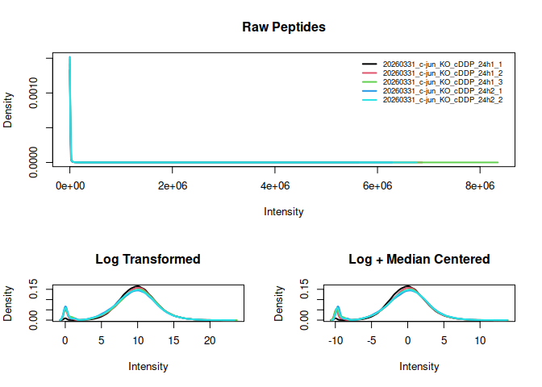
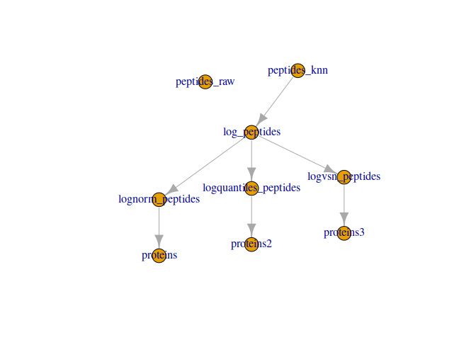

SpectroNaut_analysis
================
peyman
2026-06-01

# Packages

``` r
library(knitr)
library(data.table)
library(tidyverse)
library(ggplot2)
library(ggrepel)
library(QFeatures)
library(SummarizedExperiment)
library(limma)
```

# Load Spectronaut file

``` r
setwd('~/Desktop/proj/MsProteomics/')

df.main <- fread("./20260524/20260524_151525_MSProt2026_G3_Spectronaut_Updated_fasta_contaminants_22052026_Report.xls",
            nrows = 1000000)

colnames(df.main)
```

    ##   [1] "E.LFQMethod"                                  
    ##   [2] "R.Scan Mode (MS1)"                            
    ##   [3] "R.Scan Mode (MS2)"                            
    ##   [4] "R.Raw File Name"                              
    ##   [5] "R.Condition"                                  
    ##   [6] "R.FileName"                                   
    ##   [7] "R.Fraction"                                   
    ##   [8] "R.Label"                                      
    ##   [9] "R.Replicate"                                  
    ##  [10] "PG.GroupLabel"                                
    ##  [11] "PG.ProteinAccessions"                         
    ##  [12] "PG.ProteinGroups"                             
    ##  [13] "PG.Cscore"                                    
    ##  [14] "PG.Cscore (Run-Wise)"                         
    ##  [15] "PG.PEP"                                       
    ##  [16] "PG.PEP (Run-Wise)"                            
    ##  [17] "PG.Pvalue"                                    
    ##  [18] "PG.PValue (Run-Wise)"                         
    ##  [19] "PG.Qvalue"                                    
    ##  [20] "PG.QValue (Run-Wise)"                         
    ##  [21] "PG.RunEvidenceCount"                          
    ##  [22] "PG.Quantity"                                  
    ##  [23] "PEP.GroupingKey"                              
    ##  [24] "PEP.GroupingKeyType"                          
    ##  [25] "PEP.IsProteotypic"                            
    ##  [26] "PEP.NrOfMissedCleavages"                      
    ##  [27] "PEP.StrippedSequence"                         
    ##  [28] "PEP.Rank"                                     
    ##  [29] "PEP.RunEvidenceCount"                         
    ##  [30] "PEP.UsedForProteinGroupQuantity"              
    ##  [31] "EG.CompensationVoltage"                       
    ##  [32] "EG.FoundInDB"                                 
    ##  [33] "EG.IntModifiedPeptide"                        
    ##  [34] "EG.IntPIMID"                                  
    ##  [35] "EG.IonMobility"                               
    ##  [36] "EG.iRTPredicted"                              
    ##  [37] "EG.IsDecoy"                                   
    ##  [38] "EG.Label"                                     
    ##  [39] "EG.Library"                                   
    ##  [40] "EG.ModifiedPeptide"                           
    ##  [41] "EG.ModifiedSequence"                          
    ##  [42] "EG.PrecursorId"                               
    ##  [43] "EG.UserGroup"                                 
    ##  [44] "EG.Workflow"                                  
    ##  [45] "EG.Identified"                                
    ##  [46] "EG.IsUserPeak"                                
    ##  [47] "EG.IsVerified"                                
    ##  [48] "EG.PEP"                                       
    ##  [49] "EG.Pvalue"                                    
    ##  [50] "EG.Qvalue"                                    
    ##  [51] "EG.Svalue"                                    
    ##  [52] "EG.ApexRT"                                    
    ##  [53] "EG.DatapointsPerPeak"                         
    ##  [54] "EG.DatapointsPerPeak (MS1)"                   
    ##  [55] "EG.DeltaiRT"                                  
    ##  [56] "EG.DeltaRT"                                   
    ##  [57] "EG.EndiRT"                                    
    ##  [58] "EG.EndRT"                                     
    ##  [59] "EG.FWHM"                                      
    ##  [60] "EG.FWHM (iRT)"                                
    ##  [61] "EG.iRTEmpirical"                              
    ##  [62] "EG.MeanApexRT"                                
    ##  [63] "EG.MeanTailingFactor"                         
    ##  [64] "EG.PeakWidth"                                 
    ##  [65] "EG.PeakWidth (iRT)"                           
    ##  [66] "EG.RTPredicted"                               
    ##  [67] "EG.StartiRT"                                  
    ##  [68] "EG.StartRT"                                   
    ##  [69] "EG.Comment"                                   
    ##  [70] "EG.ExtractionWindowWidth"                     
    ##  [71] "EG.SignalToNoise"                             
    ##  [72] "EG.AvgProfileQvalue"                          
    ##  [73] "EG.ConditionCV"                               
    ##  [74] "EG.GlobalCV"                                  
    ##  [75] "EG.MaxProfileQvalue"                          
    ##  [76] "EG.MinProfileQvalue"                          
    ##  [77] "EG.PercentileQvalue"                          
    ##  [78] "EG.HasLocalizationInformation"                
    ##  [79] "EG.PTMAssayCandidateScore"                    
    ##  [80] "EG.PTMAssayProbability"                       
    ##  [81] "EG.PTMLocalizationProbabilities"              
    ##  [82] "EG.PTMPositions [Carbamidomethyl (C)]"        
    ##  [83] "EG.PTMPositions [Oxidation (M)]"              
    ##  [84] "EG.PTMPositions [Acetyl (Protein N-term)]"    
    ##  [85] "EG.PTMProbabilities [Carbamidomethyl (C)]"    
    ##  [86] "EG.ProteinPTMLocations"                       
    ##  [87] "EG.PTMProbabilities [Oxidation (M)]"          
    ##  [88] "EG.PTMProbabilities [Acetyl (Protein N-term)]"
    ##  [89] "EG.PTMSites [Carbamidomethyl (C)]"            
    ##  [90] "EG.PTMSites [Oxidation (M)]"                  
    ##  [91] "EG.PTMSites [Acetyl (Protein N-term)]"        
    ##  [92] "EG.IsImputed"                                 
    ##  [93] "EG.NormalizationFactor"                       
    ##  [94] "EG.ReferenceQuantity (Settings)"              
    ##  [95] "EG.TargetQuantity (Settings)"                 
    ##  [96] "EG.TargetReferenceRatio (Settings)"           
    ##  [97] "EG.TotalQuantity (Settings)"                  
    ##  [98] "EG.UsedForPeptideQuantity"                    
    ##  [99] "EG.UsedForProteinGroupQuantity"               
    ## [100] "EG.UsedInNormalizationSet"                    
    ## [101] "EG.Cscore"                                    
    ## [102] "EG.IntCorrScore"                              
    ## [103] "EG.Noise"                                     
    ## [104] "EG.NormalizedCscore"                          
    ## [105] "FG.MS1IsotopeIntensities (Measured)"          
    ## [106] "FG.MS1IsotopeQuantity"                        
    ## [107] "FG.MS1IsotopeRelativeIntensities (Measured)"  
    ## [108] "FG.MS1IsotopeRelativeIntensities (Predicted)" 
    ## [109] "FG.MS1Quantity"                               
    ## [110] "FG.MS1RawQuantity"                            
    ## [111] "FG.MS2Quantity"                               
    ## [112] "FG.MS2RawQuantity"                            
    ## [113] "FG.HasPossibleInterference (MS1)"             
    ## [114] "FG.HasPossibleInterference (MS2)"             
    ## [115] "FG.Quantity"                                  
    ## [116] "FG.CalibratedMassAccuracy (PPM)"              
    ## [117] "FG.CalibratedMz"                              
    ## [118] "FG.MeasuredMz"                                
    ## [119] "FG.Noise"                                     
    ## [120] "FG.PPMTolerance"                              
    ## [121] "FG.PriorIonRatio"                             
    ## [122] "FG.RawMassAccuracy (PPM)"                     
    ## [123] "FG.TheoreticalMz"                             
    ## [124] "FG.Tolerance"

# Decoy ~ Target

``` r
df <- df.main %>%
  select(R.FileName, R.Condition,EG.Cscore, EG.IsDecoy) %>%
  rename(R.FileName = 'FileName',
         R.Condition = 'Condition',
         EG.IsDecoy = 'IsDecoy',
         EG.Cscore = 'Cscore')%>%
  mutate(
  type = ifelse(IsDecoy, "Decoy", "Target")
  )


tab <- df %>%
  group_by(FileName) %>%
  summarise(
    Nr_Decoy = sum(IsDecoy == "TRUE"),
    Total_Precursor = n(),
    Percent_Decoy = round(100 * mean(IsDecoy == "TRUE"), 2)
  )

kable(tab)
```

| FileName                      | Nr_Decoy | Total_Precursor | Percent_Decoy |
|:------------------------------|---------:|----------------:|--------------:|
| 20260331_c-jun_KO_cDDP_24h1_1 |    18156 |          201311 |          9.02 |
| 20260331_c-jun_KO_cDDP_24h1_2 |    18156 |          201311 |          9.02 |
| 20260331_c-jun_KO_cDDP_24h1_3 |    18156 |          201311 |          9.02 |
| 20260331_c-jun_KO_cDDP_24h2_1 |    18156 |          201311 |          9.02 |
| 20260331_c-jun_KO_cDDP_24h2_2 |    17578 |          194756 |          9.03 |

``` r
message("The average number of Decoys in all samples is:  ", mean(tab$Percent_Decoy), '%')
```

    ## The average number of Decoys in all samples is:  9.022%

``` r
p <- ggplot(df, aes(Cscore, color = type, fill = type)) +
  geom_density(alpha = 0.25, linewidth = .5) +
  facet_wrap(~FileName, ncol=10)+
  scale_color_manual(values = c(Decoy = "red", Target = "blue")) +
  scale_fill_manual(values = c(Decoy = "red", Target = "blue")) +
  labs(title = "C Score Density", x = "Score", y = "Density") +
  theme_bw()

p
```

    ## Warning: Removed 2 rows containing non-finite outside the scale range
    ## (`stat_density()`).

<!-- -->

``` r
# ggsave("Cscore Density.png", p, width = 8, height = 5, dpi = 300)
rm(df)
gc()
```

    ##             used   (Mb) gc trigger   (Mb)  max used   (Mb)
    ## Ncells  10844306  579.2   21789345 1163.7  13561619  724.3
    ## Vcells 142388573 1086.4  213392862 1628.1 185870815 1418.1

# SE object

``` r
quant_wide <- df.main %>%
  select(EG.PrecursorId, R.FileName, FG.Quantity) %>%
  mutate(FG.Quantity = as.numeric(FG.Quantity)) %>%
  pivot_wider(
    names_from = R.FileName,
    values_from = FG.Quantity,
    values_fn = max # Resolves any rare duplicate precursor entries in a single run
  ) %>%
  as.data.frame()

rownames(quant_wide) <- quant_wide$EG.PrecursorId
quant_matrix <- as.matrix(quant_wide[, -1])


col_data <- df.main %>%
  select(R.FileName, R.Condition, R.Replicate) %>%
  distinct() %>%
  as.data.frame()

rownames(col_data) <- col_data$R.FileName

quant_matrix <- quant_matrix[, rownames(col_data)]


row_data <- df.main %>%
  select(
    EG.PrecursorId,
    Sequence = PEP.StrippedSequence,
    Proteins = PG.ProteinGroups,
    PEP = EG.PEP,
    Score = EG.Cscore,
    IsDecoy = EG.IsDecoy
  ) %>%
  mutate(
    PEP = as.numeric(PEP),
    Score = as.numeric(Score)
  ) %>%
  group_by(EG.PrecursorId) %>%
  dplyr::slice(1) %>% # Take the metadata from the first appearance of the precursor
  ungroup() %>%
  as.data.frame()


rownames(row_data) <- row_data$EG.PrecursorId

# CRITICAL: Ensure the rows of the metadata match the rows of the matrix exactly
row_data <- row_data[rownames(quant_matrix), ]


spectronaut_se <- SummarizedExperiment(
  assays = list(intensity = quant_matrix),
  colData = DataFrame(col_data),
  rowData = DataFrame(row_data)
)

head(assay(spectronaut_se))
```

    ##                               20260331_c-jun_KO_cDDP_24h1_1
    ## _DGSASEVPSELSERPK_.3                            1487.657104
    ## _DGSASEVPSELSERPK_.2                               1.000000
    ## _NEFTAWYR_.2                                      76.752762
    ## _GFYVETVVTYKEDFVPNTEK_.3                          58.531525
    ## _MQLVQESEEK_.2                                   372.728363
    ## _M[Oxidation (M)]QLVQESEEK_.2                      8.320006
    ##                               20260331_c-jun_KO_cDDP_24h1_2
    ## _DGSASEVPSELSERPK_.3                             1361.61829
    ## _DGSASEVPSELSERPK_.2                               61.31200
    ## _NEFTAWYR_.2                                      263.87909
    ## _GFYVETVVTYKEDFVPNTEK_.3                            1.00000
    ## _MQLVQESEEK_.2                                     25.63280
    ## _M[Oxidation (M)]QLVQESEEK_.2                      44.75975
    ##                               20260331_c-jun_KO_cDDP_24h1_3
    ## _DGSASEVPSELSERPK_.3                             863.042053
    ## _DGSASEVPSELSERPK_.2                               1.000000
    ## _NEFTAWYR_.2                                     104.797485
    ## _GFYVETVVTYKEDFVPNTEK_.3                          10.718036
    ## _MQLVQESEEK_.2                                     3.323514
    ## _M[Oxidation (M)]QLVQESEEK_.2                    160.387253
    ##                               20260331_c-jun_KO_cDDP_24h2_1
    ## _DGSASEVPSELSERPK_.3                             1494.40735
    ## _DGSASEVPSELSERPK_.2                               18.52711
    ## _NEFTAWYR_.2                                      532.80713
    ## _GFYVETVVTYKEDFVPNTEK_.3                           42.44754
    ## _MQLVQESEEK_.2                                     15.98656
    ## _M[Oxidation (M)]QLVQESEEK_.2                     143.57387
    ##                               20260331_c-jun_KO_cDDP_24h2_2
    ## _DGSASEVPSELSERPK_.3                             1688.79846
    ## _DGSASEVPSELSERPK_.2                               34.80320
    ## _NEFTAWYR_.2                                      314.94266
    ## _GFYVETVVTYKEDFVPNTEK_.3                           25.55131
    ## _MQLVQESEEK_.2                                     82.50373
    ## _M[Oxidation (M)]QLVQESEEK_.2                     203.80109

``` r
anyNA(assay(spectronaut_se))
```

    ## [1] TRUE

``` r
rm(df.main, quant_wide, row_data, col_data, quant_matrix)
gc()
```

    ##            used  (Mb) gc trigger   (Mb)  max used   (Mb)
    ## Ncells  7874849 420.6   21789345 1163.7  21789345 1163.7
    ## Vcells 23828788 181.8  204921148 1563.5 185870815 1418.1

# Missing Values

``` r
#  png("missing_values_per_sample.png", width = 800, height = 600, res = 120)
barplot(
  nNA(spectronaut_se)$nNAcols$nNA, 
  main = "Missing Values per Sample",
  ylab = "Count of NAs",
  las = 2
)
```

<!-- -->

``` r
#  dev.off()

#  knitr::include_graphics("missing_values_per_sample.png")

table(nNA(spectronaut_se)$nNArows$nNA)
```

    ## 
    ##      0      1 
    ## 194753   6557

# Imputation

``` r
spectronaut_se <- filterNA(spectronaut_se, pNA = 60/84) #  71 %

table(nNA(spectronaut_se)$nNArows$nNA)
```

    ## 
    ##      0      1 
    ## 194753   6557

``` r
nNA(spectronaut_se)
```

    ## $nNA
    ## DataFrame with 1 row and 2 columns
    ##         nNA        pNA
    ##   <integer>  <numeric>
    ## 1      6557 0.00651433
    ## 
    ## $nNArows
    ## DataFrame with 201310 rows and 3 columns
    ##                 name       nNA       pNA
    ##          <character> <integer> <numeric>
    ## 1      _DGSASEVPS...         0         0
    ## 2      _DGSASEVPS...         0         0
    ## 3      _NEFTAWYR_...         0         0
    ## 4      _GFYVETVVT...         0         0
    ## 5      _MQLVQESEE...         0         0
    ## ...              ...       ...       ...
    ## 201306 _FIPYTEEFS...         1       0.2
    ## 201307 _AVLIPHHK_...         1       0.2
    ## 201308 _AHTSSTQEL...         1       0.2
    ## 201309 _VANQQEEKE...         1       0.2
    ## 201310 _VESHFGTSL...         1       0.2
    ## 
    ## $nNAcols
    ## DataFrame with 5 rows and 3 columns
    ##            name       nNA         pNA
    ##     <character> <integer>   <numeric>
    ## 1 20260331_c...         0 0.00000e+00
    ## 2 20260331_c...         1 4.96746e-06
    ## 3 20260331_c...         0 0.00000e+00
    ## 4 20260331_c...         0 0.00000e+00
    ## 5 20260331_c...      6556 3.25667e-02

``` r
invisible(capture.output({
  se1 <- impute(spectronaut_se, method = "knn")
}))
```

    ## Loading required namespace: impute

    ## Imputing along margin 1 (features/rows).

``` r
se2 <- impute(spectronaut_se, method = "MinDet") 
```

    ## Imputing along margin 2 (samples/columns).

``` r
se3 <- impute(spectronaut_se, method = "zero")

#  png("imputation_comparison.png", width = 1000, height = 800, res = 120)

par(mfrow = c(2, 2))

plot(density(na.omit(log2(assay(spectronaut_se)))), main = 'no imputation')
plot(density(na.omit(log2(assay(se1)))), main = 'knn')
plot(density(na.omit(log2(assay(se2)))), main = "MinDet")
plot(density(na.omit(log2(assay(se3)+1))), main = "zero")
```

<!-- -->

``` r
par(mfrow = c(1, 1))
#  dev.off()

#  knitr::include_graphics("imputation_comparison.png")
```

# QF object

``` r
# --------------------------------------
# ------- knn was selected -----------------
# -----------------------------------

# ***************************************************************
# ---------------------------------------------------------
spectronaut_qf <- QFeatures(list(
  peptides_raw = spectronaut_se,
  peptides_knn = se1              
))

# -----------------------------------------------------
rm(se1, se2, se3)
gc()
```

    ##            used  (Mb) gc trigger   (Mb)  max used   (Mb)
    ## Ncells  7903815 422.2   21789345 1163.7  21789345 1163.7
    ## Vcells 24892825 190.0  163936919 1250.8 204708460 1561.9

``` r
# -----------------------------------------------------


colData(spectronaut_qf) <- colData(spectronaut_qf[[1]])

is_contam <- grepl("CON_", rowData(spectronaut_qf[["peptides_raw"]])$Proteins)
rowData(spectronaut_qf[["peptides_raw"]])$Potential.contaminant <- ifelse(is_contam, "+", "")

is_contam <- grepl("CON_", rowData(spectronaut_qf[["peptides_knn"]])$Proteins)
rowData(spectronaut_qf[["peptides_knn"]])$Potential.contaminant <- ifelse(is_contam, "+", "")

table(rowData(spectronaut_qf[["peptides_raw"]])$IsDecoy)
```

    ## 
    ##  FALSE   TRUE 
    ## 183154  18156

``` r
table(rowData(spectronaut_qf[["peptides_raw"]])$Potential.contaminant)
```

    ## 
    ##        
    ## 201310

``` r
table(rowData(spectronaut_qf[["peptides_knn"]])$IsDecoy)
```

    ## 
    ##  FALSE   TRUE 
    ## 183154  18156

``` r
table(rowData(spectronaut_qf[["peptides_knn"]])$Potential.contaminant)
```

    ## 
    ##        
    ## 201310

``` r
spectronaut_filtered <- spectronaut_qf |>
  filterFeatures(~ IsDecoy == "FALSE" | IsDecoy == FALSE) |> 
  filterFeatures(~ Potential.contaminant != "+") |>  # Remove Contaminants (adjust "CON_" if necessary)
  filterFeatures(~ PEP < 0.05)
```

    ## 'IsDecoy' found in 2 out of 2 assay(s)

    ## 'Potential.contaminant' found in 2 out of 2 assay(s)

    ## 'PEP' found in 2 out of 2 assay(s)

``` r
dim(spectronaut_se)
```

    ## [1] 201310      5

``` r
dim(spectronaut_filtered[["peptides_raw"]])
```

    ## [1] 109085      5

``` r
dim(spectronaut_filtered[["peptides_knn"]])
```

    ## [1] 109085      5

``` r
rm(spectronaut_se, spectronaut_qf)
gc()
```

    ##            used  (Mb) gc trigger   (Mb)  max used   (Mb)
    ## Ncells  7764291 414.7   21789345 1163.7  21789345 1163.7
    ## Vcells 23805538 181.7  131149536 1000.6 204708460 1561.9

# PEP to logNormPEP

``` r
# -------------------------------------------
# ------ log scale of peptide and apply log normalization
# -----------------------------------------
spectronaut_filtered <- spectronaut_filtered |>
    logTransform(i = "peptides_knn",
                 name = "log_peptides") |>
    normalize(i = "log_peptides",
              name = "lognorm_peptides",
              method = "center.median")


# -------------------------------------------
# ------ Summarizing log norm of peptides to proteins
# -----------------------------------------
spectronaut_filtered <- aggregateFeatures(spectronaut_filtered,
                    i = "lognorm_peptides",
                    name = "proteins",
                    fcol = "Proteins",
                    fun = colMedians,
                    na.rm = TRUE)

table(rowData(spectronaut_filtered[['proteins']])$.n)
```

    ## 
    ##   1   2   3   4   5   6   7   8   9  10  11  12  13  14  15  16  17  18  19  20 
    ## 744 637 539 438 398 362 358 300 272 227 212 229 185 190 156 149 136 128 134 114 
    ##  21  22  23  24  25  26  27  28  29  30  31  32  33  34  35  36  37  38  39  40 
    ## 122  95  98  74  80  84  75  59  64  64  59  39  35  41  42  38  20  27  23  35 
    ##  41  42  43  44  45  46  47  48  49  50  51  52  53  54  55  56  57  58  59  60 
    ##  25  21  23  15  25  18  20  24  15  18  10  17  10  14  16   9   7  10  16   9 
    ##  61  62  63  64  65  66  67  68  69  70  71  72  73  74  75  76  77  78  79  80 
    ##   9  10   9   8   7  10   7   6   5   7   4   3  11   1   2   2   3   3   6   3 
    ##  81  82  83  84  85  86  87  88  90  91  92  93  94 100 102 103 104 105 106 107 
    ##   4   3   1   3   3   2   1   2   1   1   1   2   1   2   1   1   1   2   1   1 
    ## 108 109 110 112 121 123 126 130 140 143 144 146 148 154 155 156 159 160 171 174 
    ##   1   1   1   1   3   1   2   1   1   1   1   1   1   1   1   2   1   1   1   1 
    ## 193 204 225 239 251 254 269 322 337 372 
    ##   1   1   1   1   1   1   1   1   1   1

``` r
#  png("Peptides_normalization_evolution.png", width = 1200, height = 400, res = 120)

layout_matrix <- matrix(c(1, 1, 
                         # 1, 1,
                          2, 3), 
                        nrow = 2, byrow = TRUE)
layout(layout_matrix, heights = c(1.5, 1))

plotDensities(
  assay(spectronaut_filtered[["peptides_knn"]]), 
  main = "Raw Peptides", 
  legend = FALSE 
)

legend("topright", 
       legend = colnames(assay(spectronaut_filtered[["peptides_knn"]])),
       col = 1:ncol(assay(spectronaut_filtered[["peptides_knn"]])), # Matches limma's default colors
       lty = 1,       
       lwd = 2,       
       cex = 0.7,     
       bty = "n",    
       inset = 0.02   
)

plotDensities(
  assay(spectronaut_filtered[["log_peptides"]]), 
  main = "Log Transformed", 
  legend = FALSE
)

plotDensities(
  assay(spectronaut_filtered[["lognorm_peptides"]]), 
  main = "Log + Median Centered", 
  legend = FALSE 
)
```

<!-- -->

``` r
layout(1)
#  dev.off()

#  knitr::include_graphics("Peptides_normalization_evolution.png")
```

# Housekeeper’s intensity

``` r
# plot GAPDH which is a housekeeper
df <- spectronaut_filtered["P04406", ,
            c("lognorm_peptides", "proteins")] |>
  longFormat() |>
  as.data.frame() |>
  dplyr::filter(!is.na(value))
```

    ## Warning: 'experiments' dropped; see 'drops()'

    ## harmonizing input:
    ##   removing 15 sampleMap rows not in names(experiments)

``` r
p <- ggplot(df, aes(x = colname, y = value, group = rowname, color = rowname)) +
  geom_line(linewidth = 1, show.legend = F) +
  geom_point(size = 2, show.legend = F) +
  facet_wrap(~ assay) +
  theme_bw() +
  theme(axis.text.x = element_text(angle = 45, hjust = 1)) +
  labs(
    title = "Protein Aggregation Profile (P04406: GAPDH)", 
    x = "Sample", 
    y = "Normalized Intensity"
  )

p
```

<!-- -->

``` r
#  ggsave("P03915_GAPDH.png", p, width = 8, height = 5, dpi = 300)

rm(df)
gc()
```

    ##            used  (Mb) gc trigger   (Mb)  max used   (Mb)
    ## Ncells  7824280 417.9   21789345 1163.7  21789345 1163.7
    ## Vcells 21621548 165.0  104919629  800.5 204708460 1561.9

# quantile and vsn

``` r
spectronaut_filtered <- normalize(
  spectronaut_filtered,
  i = "log_peptides",
  name = "logquantiles_peptides",
  method = "quantiles") |>
  aggregateFeatures(
    i = "logquantiles_peptides",
    name = "proteins2",
    fcol = "Proteins",
    fun = colMedians,
    na.rm = TRUE) 
```

    ## Loading required namespace: preprocessCore

``` r
spectronaut_filtered <- normalize(
  spectronaut_filtered, 
  i = "log_peptides",
  name = "logvsn_peptides",
  method = "vsn"              
) |>
  aggregateFeatures(
    i = "logvsn_peptides",
    name = "proteins3",
    fcol = "Proteins",
    fun = colMedians,
    na.rm = TRUE
  )
```

    ## Loading required namespace: vsn

# Processing_Tree

``` r
#  png("QFeatures_Assay_Topology(Data_Processing_Tree).png", width = 1000, height = 800, res = 120)
plot(spectronaut_filtered)
```

<!-- -->

``` r
#  dev.off()

#  save(spectronaut_filtered, file = 'spectronaut_filtered.RData')

#  knitr::include_graphics("QFeatures_Assay_Topology(Data_Processing_Tree).png")
```

# Comparison of normalization methods

``` r
#  png("comparison_of_normalized_methods.png", width = 1200, height = 1000, res = 120)

par(mfrow = c(1, 3), mar = c(8, 4, 4, 1))

boxplot(assay(spectronaut_filtered[["proteins"]]), 
        main = "Median Centered", 
        col = "lightblue", 
        las = 2) 

boxplot(assay(spectronaut_filtered[["proteins2"]]), 
        main = "Quantiles", 
        col = "lightgreen", 
        las = 2)

boxplot(assay(spectronaut_filtered[["proteins3"]]), 
        main = "VSN", 
        col = "lightcoral", 
        las = 2)
```

<!-- -->

``` r
par(mfrow = c(1, 1))
#  dev.off()

#  knitr::include_graphics("comparison_of_normalized_methods.png")
```

# PCA

``` r
# --------------------------------------
# ------- quantile normalization was selected -----------------
# -----------------------------------

# ***************************************************************

# --------------------------------------------------------
mat <- assay(spectronaut_filtered[["proteins2"]])

mat_complete <- mat[rowSums(is.na(mat)) == 0, ]

message("Number of proteins used for PCA: ", nrow(mat_complete))
```

    ## Number of proteins used for PCA: 7588

``` r
mat_transposed <- t(mat_complete)

pca_result <- prcomp(mat_transposed, scale. = TRUE)

# ------------------------------------
rm(mat, mat_complete, mat_transposed)
gc()
```

    ##            used  (Mb) gc trigger   (Mb)  max used   (Mb)
    ## Ncells  8020377 428.4   21789345 1163.7  21789345 1163.7
    ## Vcells 24689987 188.4   83935704  640.4 204708460 1561.9

``` r
# ------------------------------------

var_explained <- (pca_result$sdev^2) / sum(pca_result$sdev^2) * 100
pc1_var <- round(var_explained[1], 1)
pc2_var <- round(var_explained[2], 1)

pca_df <- as.data.frame(pca_result$x) %>%
  mutate(R.FileName = rownames(.)) %>%
  left_join(as.data.frame(colData(spectronaut_filtered)), by = "R.FileName")

p <- ggplot(pca_df, aes(x = PC1, y = PC2, color = R.Condition, label = R.FileName)) +
  geom_point(size = 3, alpha = 0.7) +
  geom_text_repel(size = 3, show.legend = FALSE) + 
  labs(
    title = "Principal Component Analysis (PCA)",
    subtitle = "Based on Quantile-Normalized Protein Intensities",
    x = paste0("PC1 (", pc1_var, "% Variance)"),
    y = paste0("PC2 (", pc2_var, "% Variance)")
  ) +
  theme_bw() +
  theme(
    plot.title = element_text(face = "bold", size = 14),
    axis.title = element_text(face = "bold")
  )


p
```

<!-- -->

``` r
#  ggsave("PCA.png", p, width = 8, height = 5, dpi = 300)
```
